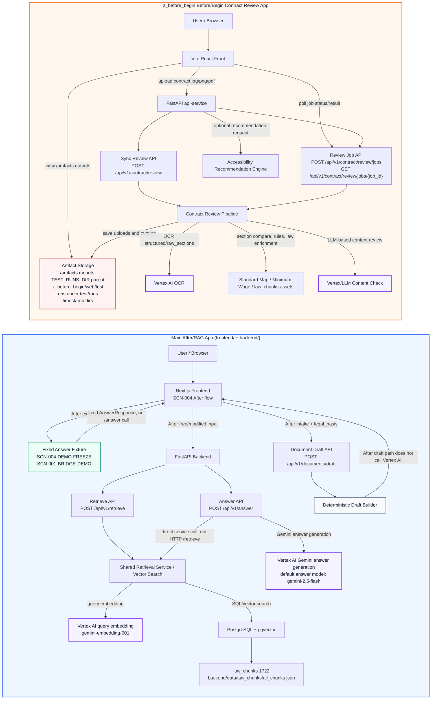

# K-Labor Shield — Current Project Architecture

기준일: `2026-04-20` 또는 현재 repo 기준

## 1. 문서 목적

이 문서는 현재 repo의 전체 구조를 `Before/Begin`, `Bridge`, `After` 관점에서 정리한다. 범위는 main `frontend/` + `backend/` After/RAG 앱과, repo 안에 병렬로 존재하는 `z_before_begin/web` Before/Begin 계약서 분석 앱을 함께 포함한다.

이 문서는 `docs/architecture/architecture_option4_*`의 target deployment architecture와 다르다. Option 4 문서는 후속 클라우드 배포 및 self-hosted LLM 확장안을 다루며, 이 문서는 현재 구현된 MVP와 현재 repo에 존재하는 병렬 모듈의 실제 상태를 기록한다.

정확한 현재 상태 요약:

- Current architecture has two frontend/backend surfaces: main Next.js/FastAPI After app and z_before_begin Vite/FastAPI Before app.
- Bridge는 full implementation이 아니라 `SCN-001-BRIDGE-DEMO` answer-only preset과 Before/Bridge handoff 설명용 흐름이다.
- After draft path does not call Vertex AI.
- Before/Begin contract upload path currently uses Vertex AI for OCR and LLM-based content review.
- Self-hosted LLM is not part of current MVP architecture; it remains a future optional extension.

## 2. 현재 구현 범위 요약

### Main After/RAG App

| 항목 | 현재 상태 |
|---|---|
| Frontend | `frontend/`, Next.js SCN-004 After demo UI |
| Backend | `backend/`, FastAPI |
| API | `POST /api/v1/retrieve`, `POST /api/v1/answer`, `POST /api/v1/documents/draft` |
| DB | PostgreSQL + pgvector |
| Corpus | `law_chunks` 1722 rows |
| Source of truth | `backend/data/law_chunks/all_chunks.json` |
| Embedding | `gemini-embedding-001`, 768 dimensions |
| Default answer model | `gemini-2.5-flash` |
| Demo preset | `SCN-004-DEMO-FREEZE` exact path는 fixed `AnswerResponse` fixture를 사용하고 `/api/v1/answer`를 호출하지 않음 |
| Modified/free input | `/api/v1/answer` 호출 가능, Shared Retrieval Service + default answer model 기반 Gemini answer generation 사용 |
| Intake to draft | `/api/v1/documents/draft`, deterministic backend layer |
| Draft model boundary | retrieval / answer_generation service를 직접 호출하지 않고, request의 `legal_basis` 안에 있는 근거만 사용 |
| Frontend state | React Context + `useReducer` memory state only |
| Browser storage rule | raw `user_statement`, `answer_response`, `case_intake`, `draft_response`는 Web Storage에 저장하지 않음 |

### z_before_begin Before/Begin Contract Review App

| 항목 | 현재 상태 |
|---|---|
| 위치 | `z_before_begin/web` |
| 성격 | main 앱과 완전히 통합된 단일 앱이 아니라 repo 안에 병렬로 존재하는 Before/Begin 모듈 |
| Frontend | `z_before_begin/web/front`, Vite + React + Tailwind |
| API service | `z_before_begin/web/api-service`, FastAPI |
| Domain | `z_before_begin/web/domain`, OCR / section compare / rule validation / content check / law retrieval / explanation / accessibility recommendation |
| Assets | `z_before_begin/web/assets`, `standard_map.json`, `minimum_wage.yaml`, `law_chunks` 등 |
| API base | `VITE_API_BASE_URL` 또는 local dev default |
| Runtime UI flow | `home -> loading -> result` 단일 페이지 상태 전환 |
| Artifact storage | `z_before_begin/web/test/runs/<timestamp>/` |
| Static artifacts | `/artifacts` is mounted to `TEST_RUNS_DIR.parent`, which is `z_before_begin/web/test`; run outputs are stored under `test/runs/<timestamp>/` |
| OCR | Vertex AI 기반 OCR pipeline |
| Content review | 기본 `LLM_PROVIDER=vertex`, Ollama provider는 교체 가능 구조 |
| Accessibility | 결과 화면에서 장애 특화 recommendation 선택 확장 |

### Bridge

Bridge는 현재 별도 service나 독립 화면의 full implementation이 아니다. 현재 repo 기준 Bridge는 `SCN-001-BRIDGE-DEMO` answer-only preset으로 Before 결과가 After 질문으로 이어지는 handoff를 설명하는 데 사용된다.

## 3. 전체 컴포넌트 표

| 영역 | 컴포넌트 | 경로 / API | 현재 역할 | 모델 / 데이터 경계 |
|---|---|---|---|---|
| Main After/RAG | Next.js Frontend | `frontend/` | `/after`, `/after/result`, `/after/intake`, `/after/draft` 4-route flow | memory state only, raw payload Web Storage 저장 금지 |
| Main After/RAG | Fixed Answer Fixture | `frontend/src/lib/scenarioPresetAnswers.json` | exact preset 발표 경로 고정 응답 | `/api/v1/answer` 호출 없음 |
| Main After/RAG | FastAPI Backend | `backend/main.py`, `backend/app/routers/*` | retrieval / answer / document draft API 제공 | API contract 변경 없이 유지 |
| Main After/RAG | Retrieve API | `POST /api/v1/retrieve` | public retrieval endpoint | Shared Retrieval Service / Vector Search로 위임 |
| Main After/RAG | Answer API | `POST /api/v1/answer` | `answer_question()` 기반 grounded answer | public Retrieve API를 HTTP로 재호출하지 않고 Shared Retrieval Service를 직접 사용 |
| Main After/RAG | Shared Retrieval Service / Vector Search | `backend/app/services/retrieval.py` | query embedding + PostgreSQL/pgvector search | Vertex query embedding `gemini-embedding-001` 사용 |
| Main After/RAG | Document Draft API | `POST /api/v1/documents/draft` | SCN-004 문서 초안 생성 | deterministic builder, request `legal_basis`만 사용 |
| Main After/RAG | PostgreSQL + pgvector | local DB | `law_chunks` 1722 rows, HNSW index | corpus 검색 저장소 |
| Main After/RAG | Law chunks source | `backend/data/law_chunks/all_chunks.json` | main source of truth | 직접 수정 금지 |
| Before/Begin | Vite React Front | `z_before_begin/web/front` | 업로드, 진행 상태, 결과, accessibility panel | `VITE_API_BASE_URL` 기반 API 호출 |
| Before/Begin | FastAPI api-service | `z_before_begin/web/api-service` | contract review job / sync review / accessibility API | 업로드 파일 검증 및 run directory 저장 |
| Before/Begin | Review Job API | `POST /api/v1/contract/review/jobs`, `GET /api/v1/contract/review/jobs/{job_id}` | 비동기 분석 작업 생성 및 polling | job state는 현재 process memory |
| Before/Begin | Sync Review API | `POST /api/v1/contract/review` | 동기 계약서 리뷰 | 동일 pipeline 사용 |
| Before/Begin | OCR Pipeline | `domain/contract_analysis/ocr_pipeline.py` | `structured`, `raw_sections`, `_meta` 생성 | Vertex AI OCR 사용 |
| Before/Begin | Contract Review Pipeline | `api-service/app/api/app.py` | section compare, rule validation, content check, explanation 생성 | deterministic checks + LLM content check |
| Before/Begin | LLM Client | `domain/contract_analysis/llm_client.py` | Vertex/Ollama 추상화 | 기본 `LLM_PROVIDER=vertex` |
| Before/Begin | Assets | `z_before_begin/web/assets` | standard map, minimum wage, law chunks | generated/data asset으로 취급, 이번 문서 작업에서 수정하지 않음 |
| Before/Begin | Artifact Storage | `z_before_begin/web/test/runs` | 업로드 원본, OCR, 리뷰, 설명 markdown 저장 | 개인정보/사업장 정보 포함 가능 |
| Before/Begin | Accessibility Recommendation | `POST /api/v1/accessibility/recommendations` | 장애 유형/직무 특성 기반 카드 추천 | 기본 분석 이후 선택 확장 |
| Bridge | Answer-only preset | `SCN-001-BRIDGE-DEMO` | Before/Bridge handoff 설명 | 독립 Bridge service 아님 |
| Future docs | Option 4 architecture | `docs/architecture/architecture_option4_*` | 후속 클라우드 목표 구조 | 현재 MVP 구조와 구분 |

## 4. 기능별 요청 흐름 표

| 기능 흐름 | 요청 흐름 | 모델 사용 | 저장 / 상태 | 현재 통합 상태 |
|---|---|---|---|---|
| After exact preset | User -> Next.js `/after` -> fixed `AnswerResponse` fixture -> `/after/result` | Vertex AI 미사용, `/api/v1/answer` 호출 없음 | React Context memory state | main After app 내부 구현 완료 |
| After modified preset | User modifies preset text -> Next.js -> `POST /api/v1/answer` with `top_k=10`, `ef_search=100` | Shared Retrieval Service + default answer model `gemini-2.5-flash` | React Context memory state | main backend API 사용 |
| After free input | User free statement -> Next.js -> `POST /api/v1/answer` with `top_k=5`, `ef_search=100` | Shared Retrieval Service + default answer model `gemini-2.5-flash` | React Context memory state | main backend API 사용 |
| Retrieval direct | Client -> `POST /api/v1/retrieve` -> Shared Retrieval Service | Vertex query embedding | DB vector search only | main backend API 구현 완료 |
| After intake to draft | `/after/result` grounding + SCN-004 document-type eligibility guard -> `/after/intake` selected type recheck -> `POST /api/v1/documents/draft` -> `/after/draft` | Vertex AI 미사용 | request의 `case_intake`와 `legal_basis`를 deterministic builder가 사용 | main After draft flow 구현 완료 |
| Before/Begin async upload | Vite front upload -> `POST /api/v1/contract/review/jobs` -> polling `GET /api/v1/contract/review/jobs/{job_id}` | Vertex AI OCR + 기본 Vertex LLM content review | `test/runs/<timestamp>/`에 업로드 원본과 산출물 저장 | `z_before_begin/web` 병렬 앱 구현 |
| Before/Begin sync review | Client -> `POST /api/v1/contract/review` | Vertex AI OCR + 기본 Vertex LLM content review | `test/runs/<timestamp>/`에 업로드 원본과 산출물 저장 | `z_before_begin/web` 병렬 API |
| Before/Begin accessibility | Result screen -> `POST /api/v1/accessibility/recommendations` | 기본 추천 엔진, Vertex OCR/LLM 경로와 별도 | 선택 입력 기반 result panel 확장 | `z_before_begin/web` 병렬 앱 구현 |
| Bridge handoff demo | Before risk summary concept -> `SCN-001-BRIDGE-DEMO` answer-only preset | exact preset이면 fixed fixture, modified이면 main answer API 가능 | 독립 Bridge 저장소나 service 없음 | 설명용 preset 상태 |

SCN-004 draft flow is additionally gated by document-type eligibility. The frontend uses `getScn004DraftEligibility()` on `/after/result` to expose only wage-complaint or unfair-dismissal draft types supported by the answer evidence. The evidence check is not only `cited_articles` / `grounded_context_ids` presence; eligibility is calculated from SCN-004 wage/dismissal patterns in the answer query, `cited_articles`, and grounded `retrieved_chunks`. `/after/intake` rechecks the selected document type before building the draft request and again before submit, so grounded free input outside the supported SCN-004 document types remains answer-only and does not enter the draft flow.

## 5. Mermaid 다이어그램

동일한 다이어그램은 `docs/architecture/architecture_project_current.mmd`에도 별도 저장한다.

## 6. Vertex AI 사용 구간 / 미사용 구간

| 구간 | Vertex AI 사용 여부 | 설명 |
|---|---:|---|
| After exact preset `SCN-004-DEMO-FREEZE` | 미사용 | fixed `AnswerResponse` fixture를 사용하므로 `/api/v1/answer`를 호출하지 않는다. |
| After exact preset `SCN-001-BRIDGE-DEMO` | 미사용 | answer-only handoff 설명용 fixed fixture 경로다. |
| After modified preset | 사용 | `/api/v1/answer`가 Shared Retrieval Service로 Vertex query embedding과 PostgreSQL/pgvector search를 수행한 뒤 default answer model `gemini-2.5-flash`로 answer generation을 수행한다. |
| After free input | 사용 | `/api/v1/answer`가 `top_k=5`, `ef_search=100`으로 Shared Retrieval Service + answer path를 실행한다. |
| Main `POST /api/v1/retrieve` | 사용 | public retrieve endpoint가 Shared Retrieval Service를 통해 query embedding에 `gemini-embedding-001`을 사용하고 PostgreSQL + pgvector에서 검색한다. |
| Main `POST /api/v1/answer` | 사용 | public retrieve endpoint를 HTTP로 재호출하지 않고 Shared Retrieval Service를 직접 사용한 뒤 default answer model `gemini-2.5-flash`로 grounded answer를 생성한다. |
| Main `POST /api/v1/documents/draft` | 미사용 | After draft path does not call Vertex AI. request의 `legal_basis`와 `case_intake`만 사용한다. |
| Before/Begin upload OCR | 사용 | Vertex AI OCR pipeline이 업로드 계약서에서 `structured`와 `raw_sections`를 생성한다. |
| Before/Begin content review | 사용 | Before/Begin contract upload path currently uses Vertex AI for OCR and LLM-based content review. 기본 `LLM_PROVIDER=vertex`다. |
| Before/Begin deterministic checks | 부분 미사용 | section comparator, rule validator, law retriever, explanation builder는 deterministic / local asset 기반 로직을 포함하지만 pipeline 전체는 OCR/LLM 단계에서 Vertex를 사용한다. |
| Before/Begin accessibility recommendation | 기본 미사용 | 장애 특화 recommendation engine은 별도 추천 로직이며 계약서 OCR/LLM 경로와 분리되어 있다. |
| Self-hosted LLM / Compute Engine GPU VM | 현재 미포함 | Self-hosted LLM is not part of current MVP architecture; it remains a future optional extension. |

## 7. 개인정보 / 민감정보 처리 경계

### Main After/RAG App

- `SCN-004-DEMO-FREEZE` exact preset은 fixed fixture를 사용하므로 사용자의 exact preset 입력이 `/api/v1/answer`나 Vertex AI로 가지 않는다.
- modified preset / free input은 `/api/v1/answer`를 호출하므로 사용자 진술이 query embedding과 answer generation 과정에서 Vertex AI 경로로 전달될 수 있다.
- `/api/v1/documents/draft`는 deterministic backend layer다. After draft path does not call Vertex AI.
- draft request에는 `case_intake`와 이전 answer에서 만든 `legal_basis`가 포함된다. draft builder는 retrieval / answer_generation service를 직접 호출하지 않고 request의 `legal_basis` 안에 있는 근거만 사용한다.
- main frontend는 React Context + `useReducer` memory state only다. raw `user_statement`, `answer_response`, `case_intake`, `draft_response`는 Web Storage에 저장하지 않는다.
- MVP demo에서는 이름, 연락처, 주소 같은 직접 식별 정보를 필수로 요구하지 않고 placeholder / missing field로 남기는 정책을 유지한다.

### z_before_begin Before/Begin Contract Review App

- 계약서 업로드 파일에는 근로자 개인정보, 사업장 정보, 임금, 주소, 연락처, 외국인등록 관련 신호 등 민감정보가 포함될 수 있다.
- Before/Begin contract upload path currently uses Vertex AI for OCR and LLM-based content review. 따라서 “프로젝트 전체에서 개인정보가 Vertex로 가지 않는다”고 표현하면 안 된다.
- 업로드 원본 파일, `ocr_output.json`, `review_result.json`, `user_explanation.md`, 실패 시 `error.txt`가 `z_before_begin/web/test/runs/<timestamp>/` 아래 저장된다.
- API는 `TEST_RUNS_DIR.parent`를 `/artifacts`로 static mount한다. `TEST_RUNS_DIR`는 `z_before_begin/web/test/runs`이므로 mount scope는 `z_before_begin/web/test`이고, run outputs are stored under `test/runs/<timestamp>/`.
- 배포 아키텍처에서는 Cloud Storage / DB / logging 정책, retention, access control, artifact URL 보호, 저장 최소화, OCR/LLM provider 고지 정책이 별도로 필요하다.

## 8. 현재 통합 상태와 향후 통합 방향

### 현재 통합 상태

- 현재 repo에는 main Next.js/FastAPI After app과 `z_before_begin` Vite/FastAPI Before app이라는 두 개의 frontend/backend surface가 있다.
- 두 앱은 현재 하나의 통합된 routing surface나 단일 API contract로 묶여 있지 않다.
- main After/RAG 앱은 SCN-004 demo freeze와 `/api/v1/retrieve`, `/api/v1/answer`, `/api/v1/documents/draft` contract를 기준으로 안정화되어 있다.
- `z_before_begin/web`은 계약서 업로드 분석, job polling, artifact 저장, accessibility recommendation을 가진 병렬 Before/Begin 모듈이다.
- Bridge는 현재 `SCN-001-BRIDGE-DEMO` answer-only preset으로 handoff narrative를 설명하는 수준이며 독립 Bridge service로 구현되어 있지 않다.

### 향후 통합 방향

| 후보 | 방향 | 선행 조건 |
|---|---|---|
| UI 통합 | main Next.js 안에 Before entry를 추가하거나, 별도 Vite 앱을 유지한 채 routing / navigation만 연결 | 사용자 흐름과 배포 방식을 먼저 결정 |
| API gateway 통합 | main backend가 Before api-service를 proxy하거나, 두 FastAPI surface를 별도 service로 배포 | API contract 충돌 및 파일 업로드 보안 검토 |
| Handoff DTO | Before review result에서 After question / `SCN-001-BRIDGE-DEMO` prompt로 넘길 최소 요약 schema 정의 | 개인정보 최소화, 저장 위치, 사용자 동의 정책 |
| Corpus 정합성 | main `backend/data/law_chunks/all_chunks.json`과 `z_before_begin/web/assets/law_chunks`의 기준일 / chunk 수 정합성 관리 | asset 생성 절차와 배포 bundle 정책 정리 |
| Artifact 정책 | `test/runs` local artifact를 배포용 Cloud Storage / DB / TTL 정책으로 전환 | 개인정보 보호, 접근 제어, 로그 마스킹 기준 |

## 9. Option 4 / self-hosted LLM과의 관계

- `docs/architecture/architecture_option4_spec.md`, `architecture_option4.mmd`, `architecture_option4.drawio`는 후속 Option 4 확장안으로 유지한다.
- Option 4 target architecture의 Cloud Run, Cloud SQL, Cloud Storage, Secret Manager, Cloud Logging, Compute Engine GPU VM 구성은 현재 MVP 구현 상태가 아니다.
- Self-hosted LLM is not part of current MVP architecture; it remains a future optional extension.
- 현재 MVP는 main After/RAG에서 Gemini API 기반 retrieval / answer를 사용하고, After document draft는 deterministic builder로 분리한다.
- `z_before_begin/web`은 현재 Vertex AI OCR/LLM 기반으로 동작하며, `llm_client.py`에 Ollama provider 교체 가능 구조가 있지만 현재 기본값은 `vertex`다.
- GCP GPU self-hosted LLM은 이 current architecture 다이어그램에 넣지 않고, 후속 확장 후보 note로만 남긴다.

## 10. 주의 / 리스크

| 리스크 | 설명 | 현재 문서화 기준 |
|---|---|---|
| Before/Begin 개인정보 경계 | 계약서 업로드는 개인정보/사업장 정보가 포함될 수 있고 Vertex OCR/LLM 및 local artifact storage를 사용한다. | After draft no-Vertex 경계와 분리해서 설명해야 한다. |
| Artifact 노출 | `/artifacts`는 `TEST_RUNS_DIR.parent` static mount scope인 `z_before_begin/web/test`를 서빙한다. run outputs는 `test/runs/<timestamp>/` 아래 저장된다. | 배포 전 접근 제어, 저장 기간, 민감정보 마스킹 정책 필요 |
| After draft 근거 의존성 | draft 자체는 deterministic이지만 `legal_basis`는 이전 answer 결과에 의존한다. | cited_articles / grounded_context_ids guard와 SCN-004 document-type eligibility guard 유지 필요 |
| API contract 차이 | `z_before_begin` API는 main `/api/v1/answer` / `/api/v1/documents/draft`와 다른 contract다. | 단일 앱으로 그리지 말고 병렬 surface로 설명 |
| Bridge 오해 | Bridge는 현재 full implementation이 아니다. | answer-only preset / handoff 설명용으로 표기 |
| Self-hosted LLM 오해 | Option 4 문서에 Compute Engine GPU VM이 있어도 현재 MVP에 포함되지 않는다. | current diagram에서는 제외하고 future optional extension으로만 표기 |
| Generated / artifact directories | `z_before_begin/web/.git`, `node_modules`, `__pycache__`, `Zone.Identifier`, `dist`, `test/runs`는 분석 대상에서 제외하거나 artifact로만 취급한다. | 이번 문서 작업에서는 수정하지 않음 |
