# After Data Model

- 상태: current code-based draft
- 기준: main backend/frontend 현재 코드
- 범위: main After/RAG data model and runtime state boundary

이 문서는 `z_before_begin/`의 Before/Begin artifact/data model이 아니라 main `backend/` FastAPI, `frontend/` Next.js, PostgreSQL `law_chunks` corpus, runtime API payload, frontend React memory state가 이루는 After/RAG 데이터 모델을 정리한다. Before/Begin의 contract artifact storage, OCR output, review artifact와 섞지 않는다.

## 1. Scope

After data model은 법률 질의, RAG retrieval, grounded answer, SCN-004 intake, deterministic document draft로 이어지는 main 앱의 데이터 계약을 다룬다.

대상 데이터 객체:

| Area | Data object |
|---|---|
| Corpus / DB | `law_chunks` table, `backend/data/law_chunks/all_chunks.json` |
| Retrieval API | `RetrievalRequest`, `RetrievalResponse`, `ChunkResult` |
| Answer API | `AnswerRequest`, `AnswerResponse`, `GroundedChunkResult` |
| Draft request boundary | `LegalBasisInput`, `CaseIntake`, `DocumentDraftRequest` |
| Draft response | `DocumentDraftResponse`, `DraftPartySection`, `DraftLegalBasisSection` |
| Frontend state | `KLaborShieldFlowState` (`FlowState` shorthand), React Context + `useReducer` memory state |
| Demo fixture | `frontend/src/lib/scenarioPresetAnswers.json` fixed `AnswerResponse` fixtures |

이 문서에서 "After"는 main After/RAG 앱을 뜻한다. `z_before_begin/` artifact storage model, Before/Begin contract upload/review artifact, integrated future model은 이 문서의 source of truth가 아니다.

## 2. Data Boundary Summary

| Boundary | Current data | Persistence / call semantics |
|---|---|---|
| Persisted DB data | `law_chunks` table, `embedding` vector | PostgreSQL + pgvector에 법령 chunk와 embedding이 저장된다. 현재 app-specific case/draft payload table은 없다. |
| File data | `backend/data/law_chunks/all_chunks.json` | current source of truth. 현재 live corpus `1722` chunks, `selected_as_of = 2026-04-11`. 직접 수정 금지. |
| File data | `frontend/src/lib/scenarioPresetAnswers.json` | presentation-local fixed `AnswerResponse` fixture. exact preset path에서는 live `/api/v1/answer`를 호출하지 않는다. |
| Runtime API payload | `RetrievalRequest/Response`, `AnswerRequest/Response`, `DocumentDraftRequest/Response` | HTTP request/response로 흐르며 현재 backend app-specific DB table에 저장하지 않는다. |
| Frontend memory state | `FlowState` (`KLaborShieldFlowState`) | React Context + `useReducer` memory state only. refresh/direct URL에서 유실될 수 있다. |
| Not stored in Web Storage | raw `user_statement`, `answer_response`, `case_intake`, `draft_response` | `localStorage`, `sessionStorage`, IndexedDB 저장 경로를 두지 않는다. |
| Vertex boundary | retrieve/answer user query | `/api/v1/retrieve`는 query embedding, `/api/v1/answer`는 query embedding + Gemini answer generation으로 Vertex를 사용할 수 있다. |
| Vertex boundary | draft request | `/api/v1/documents/draft`는 Vertex를 호출하지 않고 request `case_intake`와 `legal_basis`만 사용한다. |

## 3. `law_chunks` Table / Corpus

Source code: `backend/app/models/law_chunk.py`.

| Item | Current code |
|---|---|
| Table name | `law_chunks` |
| ORM model | `LawChunk` |
| Primary key | `chunk_id: String` |
| Separate numeric `id` field | 없음. 현재 `LawChunk` model에는 별도 `id` column이 없다. |
| Model-defined index | `idx_law_chunks_law_name` on `law_name` |
| Vector field | `embedding: Vector(768) | null` |

현재 planning 기준으로 DB에는 `1722` rows와 `1722` embeddings가 ingest되어 있고, HNSW vector index `idx_law_chunks_embedding`이 준비되어 있다. 이 HNSW index는 planning/migration 기준이며, `LawChunk` model 파일에 직접 선언된 index는 `law_name` index다.

### Columns

| Field | Type / nullability | Note |
|---|---|---|
| `chunk_id` | `String`, primary key | 법령 chunk의 stable id. public `ChunkResult.chunk_id`로 노출된다. |
| `law_name` | `String(200)`, not null | 법령명. |
| `full_title` | `String(300)`, not null | 원문 title 계열 metadata. |
| `doc_type` | `String(50)`, not null | source document type metadata. |
| `legal_type` | `String(50)`, not null | 현재 model의 법령 type field. `law_type`이라는 별도 field는 없다. |
| `law_mst` | `String(20)`, not null | 법령 마스터 식별 metadata. |
| `law_id` | `String(20)`, not null | 법령 id. |
| `ministry` | `JSONB`, not null | 소관 부처 list. |
| `status` | `String(20)`, not null | 법령 상태 metadata. |
| `law_field` | DB column `field`, `String(100)`, not null | default/server default `""`. |
| `part` | `String(100) | null` | 편 metadata. |
| `chapter` | `String(200) | null` | 장 metadata. |
| `section` | `String(200) | null` | 절 metadata. |
| `subsection` | `String(200) | null` | 관/하위 구조 metadata. |
| `structure_path` | `Text | null` | UI/API response에도 일부 노출되는 구조 경로. |
| `article_no` | `String(30)`, not null | 조문 번호. |
| `article_ordinal` | `Integer`, not null | 조문 순서 보존용 ordinal. |
| `article_title` | `String(200)`, not null | 조문 제목. |
| `article_label` | `String(200)`, not null | 조문 label. |
| `parent_article` | `String(30) | null` | split/derived article parent metadata. |
| `paragraph_no` | `Integer | null` | 항 단위 split이면 항 번호. |
| `citation_label` | `String(300)`, not null | answer/draft citation label의 source. |
| `chunk_id_suffix` | `String(50)`, not null | default/server default `""`. |
| `content` | `Text`, not null | retrieval 결과 본문. |
| `content_normalized` | `Text`, not null | normalized content. |
| `embedding_text` | `Text`, not null | embedding 생성에 사용한 text. |
| `char_count_original` | `Integer`, not null | 원문 글자 수. |
| `char_count_normalized` | `Integer`, not null | normalized 글자 수. |
| `promulgation_date` | `Date | null` | 공포일. |
| `enforcement_date` | `Date | null` | 시행일. |
| `selected_as_of` | `Date`, not null | frozen corpus 기준일. current planning 기준 `2026-04-11`. |
| `source_url` | `Text`, not null | 원문 source URL. |
| `source_ref` | `Text`, not null | source reference. |
| `relative_path` | `Text`, not null | `data/legalize-kr/` 내 source path metadata. |
| `selected_commit` | `String(64)`, not null | selected source commit metadata. |
| `tier` | `Integer`, not null | retrieval tier. |
| `embedding` | `Vector(768) | null` | pgvector embedding. query vector도 `768` dimension이어야 한다. |

Corpus boundary:

- current source of truth: `backend/data/law_chunks/all_chunks.json`
- current live corpus: `1722` chunks
- current frozen metadata: `selected_as_of = 2026-04-11`
- `backend/data/law_chunks/` 직접 수정 금지
- `data/legalize-kr/` 직접 수정 금지

## 4. Retrieval Data Shapes

Source code: `backend/app/schemas/retrieval.py`, `backend/app/services/retrieval.py`.

### `RetrievalRequest`

| Field | Type | Required | Default | Validation |
|---|---|---:|---|---|
| `query` | `str` | Yes | - | router에서 `.strip()` 후 blank이면 `422` |
| `top_k` | `int` | No | `5` | `ge=1`, `le=10` |
| `ef_search` | `int` | No | `100` | `ge=10`, `le=500` |

`RetrievalRequest`는 `extra="forbid"`다. 서비스 상수도 `DEFAULT_TOP_K=5`, `DEFAULT_EF_SEARCH=100`, `MAX_TOP_K=10`, `MIN_EF_SEARCH=10`, `MAX_EF_SEARCH=500`이다.

### `RetrievalResponse`

| Field | Type | Semantics |
|---|---|---|
| `query` | `str` | stripped original query. |
| `total` | `int` | returned chunk count. |
| `chunks` | `ChunkResult[]` | public retrieval chunks. |
| `cited_articles` | `str[]` | returned chunks의 unique `citation_label` list. |

현재 `/api/v1/retrieve` response에는 `results`, `top_k`, `context_id` field가 없다.

### `ChunkResult`

| Field | Type | Semantics |
|---|---|---|
| `chunk_id` | `str` | `law_chunks.chunk_id`. |
| `citation_label` | `str` | answer/draft citation label source. |
| `law_name` | `str` | 법령명. |
| `article_no` | `str` | 조문 번호. |
| `article_title` | `str` | 조문 제목. |
| `paragraph_no` | `int | null` | 항 번호 또는 `null`. |
| `content` | `str` | retrieved chunk body. |
| `similarity` | `float` | `1.0 - cosine_distance`. Field명은 `score`가 아니라 `similarity`. |
| `tier` | `int` | corpus tier. |
| `structure_path` | `str | null` | 법령 구조 경로. |

### `/retrieve` chunk vs `/answer` chunk

| Shape | Has `context_id`? | Purpose |
|---|---:|---|
| `/api/v1/retrieve` `ChunkResult` | No | raw public retrieval result shape. |
| `/api/v1/answer` `GroundedChunkResult` | Yes | `ChunkResult`에 1-based `context_id`를 붙인 answer grounding shape. |

`context_id`는 retrieval service DB field가 아니라 answer generation service가 retrieved chunks를 prompt context로 열거하면서 `1`부터 부여하는 runtime id다.

## 5. Answer Data Shapes

Source code: `backend/app/schemas/answer.py`, `backend/app/services/answer_generation.py`, `frontend/src/types/api.ts`.

### `AnswerRequest`

| Field | Type | Required | Default | Validation |
|---|---|---:|---|---|
| `query` | `str` | Yes | - | router에서 `.strip()` 후 blank이면 `422` |
| `top_k` | `int` | No | `5` | `ge=1`, `le=10` |
| `ef_search` | `int` | No | `100` | `ge=10`, `le=500` |

`AnswerRequest`는 `extra="forbid"`다. Public `AnswerRequest`에는 `model_name` field가 없다. `model_name`은 service 내부 optional argument 및 env override resolution에는 존재하지만, router request body로 받지 않는다.

### `GroundedChunkResult`

`GroundedChunkResult`는 `ChunkResult` + `context_id: int`다.

| Additional field | Type | Semantics |
|---|---|---|
| `context_id` | `int` | prompt context에서 1부터 부여되는 runtime id. `grounded_context_ids`의 target이다. |

### `AnswerResponse`

| Field | Type | Semantics |
|---|---|---|
| `query` | `str` | stripped original query. |
| `answer` | `str` | grounded answer body. |
| `key_points` | `str[]` | grounded key point list. |
| `cautions` | `str[]` | limitations/cautions. |
| `cited_articles` | `str[]` | `grounded_context_ids`에서 만든 unique citation labels. |
| `grounded_context_ids` | `int[]` | answer가 실제 근거로 사용한 retrieved context IDs. |
| `retrieved_chunks` | `GroundedChunkResult[]` | retrieval result chunks with `context_id`. Cited subset은 `grounded_context_ids`로 구분한다. |
| `retrieval_total` | `int` | retrieval returned chunk count. |
| `model_name` | `str` | resolved answer model name. default `gemini-2.5-flash`. |

Answer generation flow:

```text
AnswerRequest
  -> answer router
  -> answer_question(query, top_k, ef_search)
  -> retrieve_law_chunks(query, top_k, ef_search)
  -> build_grounded_chunks(): ChunkResult + context_id
  -> Gemini grounded answer JSON: cited_context_ids, answer, key_points, cautions
  -> normalize/expand/validate grounded_context_ids
  -> AnswerResponse
```

Important semantics:

- `/api/v1/answer`는 public `/api/v1/retrieve` endpoint를 HTTP로 재호출하지 않고 shared retrieval service를 직접 호출한다.
- `retrieved_chunks`는 `context_id`가 붙은 retrieved chunk list다. `grounded_context_ids`에 포함되지 않은 retrieved chunks도 response에 남을 수 있다.
- `cited_articles`는 `grounded_context_ids` 순서에서 citation label을 dedupe해 만든다.
- answer text/key_points/cautions의 explicit citation은 retrieved and grounded context 범위 안에 있어야 한다.
- `AnswerResponse`는 draft request의 `legal_basis` source가 될 수 있다.

### Fixed fixture path

`frontend/src/lib/scenarioPresetAnswers.json`은 fixed `AnswerResponse`-like payload를 저장한다. `frontend/src/lib/scenarioPresets.ts`에서 `AnswerResponse`로 typed casting한다.

| Preset | Runtime behavior |
|---|---|
| `SCN-004-DEMO-FREEZE` exact path | fixed fixture 사용. `/api/v1/answer` 호출 없음. |
| `SCN-001-BRIDGE-DEMO` exact path | fixed answer-only fixture 사용. `/api/v1/answer` 호출 없음. |
| modified preset path | `top_k=10`, `ef_search=100`, live `/api/v1/answer` 호출. |
| free input path | `top_k=5`, `ef_search=100`, live `/api/v1/answer` 호출. |

Fixture의 `model_name`이 `gemini-2.5-flash`로 표시될 수 있어도 exact path에서는 runtime Gemini call을 의미하지 않는다.

## 6. `LegalBasisInput`

Source code: `backend/app/schemas/document_draft.py`, `frontend/src/lib/api.ts`.

`LegalBasisInput`은 draft endpoint가 사용할 수 있는 법적 근거 경계다. Draft service는 이 객체 밖의 법령 근거를 새로 검색하지 않는다.

| Field | Backend type/default | Frontend source |
|---|---|---|
| `answer_query` | `Text | None = None` | `optionalText(response.query) ?? null` |
| `answer` | `Text | None = None` | `optionalText(response.answer) ?? null` |
| `key_points` | `list[Text] = []` | `response.key_points` |
| `cautions` | `list[Text] = []` | `response.cautions` |
| `cited_articles` | `list[Text] = []` | `response.cited_articles` |
| `source_context_ids` | `list[PositiveContextId] = []` | `response.grounded_context_ids` |
| `retrieved_chunks` | `list[LegalBasisChunk] = []` | filtered `response.retrieved_chunks` |

`buildLegalBasis(response)` semantics:

1. `response.grounded_context_ids`를 `Set`으로 만든다.
2. `answer_query`, `answer`, `key_points`, `cautions`, `cited_articles`, `source_context_ids`를 `AnswerResponse`에서 복사한다.
3. `retrieved_chunks`는 `response.retrieved_chunks.filter(chunk => groundedContextIds.has(chunk.context_id))`로 `grounded_context_ids`에 포함된 chunk만 전달한다.

`LegalBasisChunk` backend shape는 `GroundedChunkResult`와 같은 실질 필드를 갖되 document draft schema 안에서 다시 선언되어 있다.

| Field | Type |
|---|---|
| `context_id` | positive int |
| `chunk_id` | `Text` |
| `citation_label` | `Text` |
| `law_name` | `Text` |
| `article_no` | `Text` |
| `article_title` | `Text` |
| `paragraph_no` | positive int or `null` |
| `content` | `Text` |
| `similarity` | `float >= 0` |
| `tier` | positive int |
| `structure_path` | `Text | null` |

Draft service boundary:

- `document_draft` service는 retrieval service를 import/call하지 않는다.
- `document_draft` service는 answer generation service를 import/call하지 않는다.
- legal basis는 request `legal_basis.cited_articles`, `legal_basis.source_context_ids`, `legal_basis.retrieved_chunks` 안에서만 사용한다.

## 7. `CaseIntake` / `DocumentDraftRequest`

Source code: `backend/app/schemas/document_draft.py`, `frontend/src/lib/api.ts`.

### `DocumentDraftRequest`

| Field | Type | Required | Semantics |
|---|---|---:|---|
| `case_intake` | `CaseIntake` | Yes | user-provided or placeholder case facts. |
| `legal_basis` | `LegalBasisInput` | Yes | previous answer-derived legal basis. |

`DocumentDraftRequest`와 nested schema는 `StrictSchema` 기반이다.

| Policy | Current code |
|---|---|
| extra fields | `extra="forbid"` |
| string cleanup | `str_strip_whitespace=True` |
| non-null string minimum | `str_min_length=1`, `Text = Annotated[str, Field(min_length=1)]` |
| missing optional facts | optional fields can be `null`; builder uses placeholders or `missing_fields` |
| default list/object | nested objects and lists use `default_factory` where defined |

### `CaseIntake`

| Field | Backend type/default | Frontend build behavior |
|---|---|---|
| `scenario_id` | `ScenarioId` | always `SCN-004` in current frontend |
| `document_type` | `DocumentType` | selected SCN-004 document type |
| `language` | `DraftLanguage = ko` | always `ko` |
| `worker_info` | `WorkerInfo = {}` | cleaned optional object |
| `employer_info` | `EmployerInfo = {}` | cleaned optional object |
| `employment_info` | `EmploymentInfo = {}` | cleaned optional object |
| `dismissal_info` | `DismissalInfo = {}` | cleaned optional object |
| `unpaid_wage_info` | `UnpaidWageInfo = {}` | cleaned optional object |
| `incident_timeline` | `TimelineEvent[] = []` | rows without `event` removed |
| `claims` | `Claim[] = []` | derived from selected document type |
| `evidence_items` | `EvidenceItem[] = []` | invalid/blank rows removed |
| `requested_actions` | `Text[] = []` | derived from selected document type |
| `intake_notes` | `Text | None = None` | optional trimmed text or `null` |

Nested structures:

| Shape | Fields |
|---|---|
| `WorkerInfo` | `name_or_placeholder`, `nationality`, `preferred_language` |
| `EmployerInfo` | `company_name_or_placeholder`, `representative_name`, `workplace_address`, `employee_count`, `employee_count_over_5`, `workplace_jurisdiction` |
| `EmploymentInfo` | `start_date`, `last_work_date`, `job_title`, `wage_terms`, `wage_type`, `wage_payment_day`, `employment_contract_exists`, `continuous_service_over_1_year` |
| `DismissalInfo` | `dismissal_notice_date`, `dismissal_effective_date`, `notice_method`, `written_notice_received`, `dismissal_reason_provided`, `dismissal_reason`, `advance_notice_30_days`, `reinstatement_requested`, `monetary_compensation_requested`, `opportunity_to_explain`, `prior_disciplinary_action` |
| `UnpaidWageInfo` | `final_wage_paid`, `unpaid_wage_amount`, `unpaid_period_start`, `unpaid_period_end`, `severance_paid`, `unpaid_severance_amount`, `days_since_separation_over_14` |
| `EvidenceItem` | `type`, `description`, `status` |
| `IncidentTimelineEvent` / `TimelineEvent` | `date`, `event`, `evidence_refs` |

Enums:

| Enum | Backend values | Current frontend exposure |
|---|---|---|
| `DocumentType` | `labor_office_wage_complaint`, `labor_commission_unfair_dismissal_brief`, `family_leave_reapplication`, `written_reason_request`, `certified_letter`, `workplace_change_reason_summary`, `consultation_case_summary` | only `labor_office_wage_complaint`, `labor_commission_unfair_dismissal_brief` |
| `ScenarioId` | `SCN-001`, `SCN-004`, `SCN-005` | only `SCN-004` in current `CaseIntake` |
| `DraftLanguage` | `ko`, `en` | current frontend sends `ko` |
| `NoticeMethod` | `written`, `kakaotalk`, `sms`, `email`, `verbal`, `phone`, `unknown` | same |
| `WageType` | `hourly`, `daily`, `weekly`, `monthly`, `annual`, `piece_rate`, `other`, `unknown` | same |
| `Claim` | `unfair_dismissal`, `no_written_dismissal_notice`, `no_advance_dismissal_notice`, `unpaid_final_wages`, `unpaid_severance_pay`, `delay_interest_possible` | derived by document type |
| `EvidenceType` | `message`, `sms`, `email`, `paystub`, `bank_statement`, `employment_contract`, `attendance_record`, `work_schedule`, `recording`, `photo`, `memo` | same |
| `EvidenceStatus` | `available`, `needs_collection`, `unknown` | `EvidenceUiStatus` type includes `not_selected`, but the current visible/default UI path primarily uses `unknown` unless explicitly selected. TODO: confirm `not_selected` runtime usage before documenting it as an active UI state. |

`buildCaseIntake()` derived values:

| Document type | `claims` | `requested_actions` |
|---|---|---|
| `labor_office_wage_complaint` | `unpaid_final_wages`, `unpaid_severance_pay`, `delay_interest_possible` | 미지급 임금/퇴직금 지급 요청, 금품청산/지연이자 검토 요청 |
| `labor_commission_unfair_dismissal_brief` | `unfair_dismissal`, `no_written_dismissal_notice`, `no_advance_dismissal_notice` | 부당해고 구제신청 인용 요청, 원직복직 또는 금전보상 검토 요청 |

Privacy note:

- `case_intake`에는 개인/사건 정보가 포함될 수 있다.
- 현재 MVP schema는 전화번호, 이메일, 외국인등록번호, 계좌번호 같은 직접 식별 정보를 필수로 요구하지 않는다.
- 입력하지 않은 사실은 draft에서 단정하지 않고 placeholder 또는 `missing_fields`로 남긴다.
- `/api/v1/documents/draft` endpoint 자체는 Vertex를 호출하지 않는다.

## 8. `DocumentDraftResponse`

Source code: `backend/app/schemas/document_draft.py`, `backend/app/services/document_draft.py`.

### Response fields

| Field | Type | Semantics |
|---|---|---|
| `document_type` | `DocumentType` | generated document type. |
| `title` | `Text` | document title. |
| `recipient` | `Text` | submit/recipient target. |
| `language` | `DraftLanguage` | current frontend sends `ko`. |
| `parties` | `DraftPartySection` | worker/employer display values. |
| `facts` | `Text[]` | deterministic facts from intake. |
| `legal_basis` | `DraftLegalBasisSection[]` | filtered legal basis sections. |
| `request` | `Text[]` | request items. |
| `evidence_checklist` | `Text[]` | provided evidence descriptions + default checklist. |
| `missing_fields` | `Text[]` | missing user facts or missing answer grounding fields. |
| `cautions` | `Text[]` | base cautions + answer cautions + deterministic cautions. |
| `cited_articles` | `Text[]` | citations included in generated legal basis sections. |
| `source_context_ids` | positive int[] | response-level context ID list aggregated from legal basis sections, with fallback semantics below. |
| `missing_legal_basis` | `Text[]` | required citations absent from request `legal_basis`. |
| `rendered_text` | `Text` | assembled draft body for display/copy/print. |

Nested response shapes:

| Shape | Fields |
|---|---|
| `DraftPartySection` | `worker`, `employer`, `representative_name`, `workplace_address` |
| `DraftLegalBasisSection` | `citation_label`, `summary`, `source_context_ids` |

### Deterministic generation

`build_document_draft(payload)` calls deterministic builders in this order:

| Builder | Output |
|---|---|
| `_document_metadata` | `title`, `recipient` |
| `_build_parties` | placeholder-aware party section |
| `_build_facts` | document-type-specific facts |
| `_build_legal_basis_sections` | filtered legal basis sections |
| `_build_request_items` | document-type-specific request items |
| `_build_evidence_checklist` | user evidence + default checklist |
| `_build_missing_fields` | missing facts and legal basis presence checks |
| `_build_cautions` | base + answer + deterministic cautions |
| `_source_context_ids_for_response` | response-level context id aggregation |
| `_missing_legal_basis` | required article key misses |
| `_render_document` | final `rendered_text` |

### Legal basis filtering

| Document type | Allowed article keys | Required article keys |
|---|---|---|
| `labor_office_wage_complaint` | `lsa_36`, `retirement_9`, `lsa_37` | `lsa_36`, `retirement_9` |
| `labor_commission_unfair_dismissal_brief` | `lsa_23`, `lsa_26`, `lsa_27`, `lsa_28`, `lsa_rule_5` | `lsa_23`, `lsa_26`, `lsa_27`, `lsa_28` |
| Other valid backend enum values | all known `ARTICLE_LABELS` | none |

Article key labels:

| Key | Citation label |
|---|---|
| `lsa_23` | `근로기준법 제23조 (해고 등의 제한)` |
| `lsa_26` | `근로기준법 제26조 (해고의 예고)` |
| `lsa_27` | `근로기준법 제27조 (해고사유 등의 서면통지)` |
| `lsa_28` | `근로기준법 제28조 (부당해고등의 구제신청)` |
| `lsa_36` | `근로기준법 제36조 (금품 청산)` |
| `lsa_37` | `근로기준법 제37조 (미지급 임금에 대한 지연이자)` |
| `retirement_9` | `근로자퇴직급여 보장법 제9조 (퇴직금의 지급 등)` |
| `lsa_rule_5` | `근로기준법 시행규칙 제5조 (부당해고등의 구제신청)` |

`missing_legal_basis`는 required article keys 중 request `legal_basis.cited_articles`에 matching citation이 없는 항목이다. Draft service는 누락된 근거를 새로 검색하거나 생성하지 않는다.

### `source_context_ids` semantics

이 절은 `docs/specs/after/api_spec.md`와 동일한 의미를 유지한다.

1. 우선 `legal_basis.retrieved_chunks` 기반으로 citation별 context id mapping을 만든다. 같은 article key로 matching되는 retrieved chunk의 `context_id`가 section별 `source_context_ids`에 들어간다.
2. retrieved chunk mapping이 전혀 없고 `legal_basis_input.cited_articles.length === legal_basis_input.source_context_ids.length`이면 citation/source_context_ids zip fallback으로 section별 `source_context_ids`를 채울 수 있다.
3. `legal_basis` section은 있는데 모든 section별 `source_context_ids`가 비어 있으면 response-level `source_context_ids`는 전체 `legal_basis_input.source_context_ids`로 fallback할 수 있다.

3번은 grounding evidence를 보존하기 위한 response-level fallback이다. 이 response-level fallback을 citation별 retrieved chunk mapping과 동일하다고 단정하면 안 된다. Downstream UI나 문서에서 response-level `source_context_ids`를 "각 citation이 이 context와 1:1로 매핑된다"는 의미로 재해석하지 않는다.

## 9. Frontend `FlowState` / Memory State

Source code: `frontend/src/types/flow.ts`, `frontend/src/context/FlowContext.tsx`.

현재 실제 interface 이름은 `KLaborShieldFlowState`다. 이 문서에서는 간단히 `FlowState`라고도 부른다.

### `FlowState` fields

| Field | Type | Semantics |
|---|---|---|
| `user_statement` | `string` | current statement text. |
| `selected_preset_id` | `ScenarioPresetId | null` | selected fixed/live preset id. |
| `answer_response` | `AnswerResponse | null` | current answer result. |
| `selected_document_type` | `DocumentType | null` | selected draft document type. |
| `legal_basis` | `LegalBasisInput | null` | answer-derived draft legal basis. |
| `case_intake_form` | `CaseIntakeFormValues | null` | UI form values before normalized API payload. |
| `case_intake` | `CaseIntake | null` | normalized API payload for draft. |
| `evidence_status_map` | `Record<string, EvidenceUiStatus>` | reducer-managed field reserved for evidence status. Current UI call path is not confirmed; `/after/draft` evidence checklist status is managed by `EvidenceChecklist` component local `useState`. |
| `draft_response` | `DocumentDraftResponse | null` | current generated draft. |
| `error` | 없음 | global FlowState에는 `error` field가 없다. error state는 page component local state로 관리된다. |

Initial state:

| Field | Initial value |
|---|---|
| `user_statement` | `""` |
| `selected_preset_id` | `null` |
| `answer_response` | `null` |
| `selected_document_type` | `null` |
| `legal_basis` | `null` |
| `case_intake_form` | `null` |
| `case_intake` | `null` |
| `evidence_status_map` | `{}` |
| `draft_response` | `null` |

### Reducer actions

| Action | Main effect |
|---|---|
| `SET_STATEMENT` | sets `user_statement`, `selected_preset_id`; clears answer, legal basis, selected doc type, intake, draft. |
| `SET_ANSWER` | sets `answer_response`; clears legal basis, selected doc type, intake, draft. |
| `SET_LEGAL_BASIS` | sets `legal_basis`. |
| `SET_DOCUMENT_TYPE` | sets `selected_document_type`; clears intake form, intake, draft. |
| `SET_CASE_INTAKE_FORM` | sets `case_intake_form`. |
| `SET_CASE_INTAKE` | sets `case_intake`; clears draft. |
| `SET_EVIDENCE_STATUS` | updates one key in `evidence_status_map`; currently unused by the visible UI call path and kept as a reserved reducer action. |
| `SET_DRAFT` | sets `draft_response`. |
| `CLEAR_DRAFT` | clears `draft_response`. |
| `CLEAR_DRAFT_AND_CASE_INTAKE` | clears intake form, intake, draft. |
| `RESET` | returns `initialFlowState`. |

### Storage and route guard semantics

| Route | Guard / state behavior |
|---|---|
| `/after` | user input is component state + FlowState. exact fixed preset uses fixture, modified/free path calls `/api/v1/answer`. |
| `/after/result` | if `answer_response` missing, redirects to `/after`. |
| `/after/result` | shows draft document types only if `hasDraftGrounding(answer)` and `getScn004DraftEligibility(answer)` pass. |
| `/after/intake` | if answer missing, redirects to `/after`; if no grounding, no document type, or selected type is not eligible, redirects to `/after/result`. |
| `/after/intake` submit | re-runs `getScn004DraftEligibility(answer)`, builds `legal_basis`, builds `case_intake`, calls `/api/v1/documents/draft`. |
| `/after/draft` | if `draft_response` missing, redirects to `/after`. |
| `/after/draft` back navigation | draft cleanup is deferred until unmount for intentional back-navigation. |

Storage boundary:

- State is React Context + `useReducer` memory state only.
- raw `user_statement`, `answer_response`, `case_intake`, `draft_response` are not persisted to Web Storage.
- Direct URL refresh can lose state and trigger route guard redirects.
- Privacy: raw payloads are not persisted to browser storage in current frontend.

## 10. SCN-004 Draft Eligibility Data

Source code: `frontend/src/lib/scn004DraftEligibility.ts`.

### Function

```ts
getScn004DraftEligibility(response: AnswerResponse): Scn004DraftEligibility
```

Input:

| Input | Type |
|---|---|
| `response` | `AnswerResponse` |

Output:

| Field | Type | Semantics |
|---|---|---|
| `isEligible` | `boolean` | `true` if any supported SCN-004 document type is eligible. |
| `documentTypes` | `Record<DocumentType, boolean>` | currently has booleans for `labor_office_wage_complaint` and `labor_commission_unfair_dismissal_brief`. |
| reasons/evidence | 없음 | 현재 output shape에는 reasons, matched patterns, evidence explanation field가 없다. |

### Matching inputs

| Signal source | Code behavior |
|---|---|
| `queryText` | `response.query` |
| `citedArticleText` | `response.cited_articles.join('\n')` |
| `chunkText` | relevant chunks converted to citation/law/article/content text |

`getRelevantChunks(response)` behavior:

1. If `grounded_context_ids.length === 0`, use all `retrieved_chunks`.
2. Else filter `retrieved_chunks` to chunks whose `context_id` is in `grounded_context_ids`.
3. If the filtered list is empty, fallback to all `retrieved_chunks`.

### Eligibility logic summary

| Document type | Evidence pattern |
|---|---|
| `labor_office_wage_complaint` | wage query keywords such as 임금 체불/미지급 임금/월급 못 받음/퇴직금/금품청산, 14일 query-only pattern, wage citation patterns (`근로기준법 제36조`, `제37조`, `근로자퇴직급여 보장법 제9조`), or matching grounded chunk text. |
| `labor_commission_unfair_dismissal_brief` | dismissal query keywords such as 부당해고/해고/서면통지/해고예고/노동위원회, dismissal citation patterns (`근로기준법 제23조`, `제26조`, `제27조`, `제28조`, `근로기준법 시행규칙 제5조`), or matching grounded chunk text. |

Route usage:

- `/after/result` exposes only eligible document types.
- `/after/result` also blocks draft flow when `cited_articles` or `grounded_context_ids` is empty through `hasDraftGrounding()`.
- `/after/intake` rechecks the selected document type before allowing submit.
- `/after/intake` submit re-runs `getScn004DraftEligibility(answer)` immediately before `fetchDraft()`.
- Grounded free input이라도 supported SCN-004 document type evidence가 없으면 answer-only로 남는다.

## 11. Fixed Fixture Data

Source code: `frontend/src/lib/scenarioPresetAnswers.json`, `frontend/src/lib/scenarioPresets.ts`.

Purpose:

- `scenarioPresetAnswers.json` stores presentation-local fixed `AnswerResponse`-like payloads.
- `scenarioPresets.ts` owns preset metadata such as `supportsDraft` and `recommendedTopK`, plus the `fixedAnswer` relationship to the JSON fixture.
- demo freeze and answer-only bridge handoff stability
- exact preset path에서 live model drift와 provider availability를 피함

Preset metadata and fixed fixture relationship:

| Preset | Scenario | `supportsDraft` metadata | `recommendedTopK` metadata | Fixed fixture source | Boundary |
|---|---|---:|---:|---|---|
| `SCN-001-BRIDGE-DEMO` | `SCN-001` | `false` | `10` | `scenarioPresetAnswers.json` | Before/Bridge handoff explanation용 answer-only preset. |
| `SCN-004-DEMO-FREEZE` | `SCN-004` | `true` | `10` | `scenarioPresetAnswers.json` | main demo / document draft freeze preset. |

Runtime path:

```text
/after exact preset query
  -> preset.fixedAnswer from scenarioPresetAnswers.json
  -> SET_ANSWER
  -> /after/result
```

Boundary notes:

- exact path는 `/api/v1/answer` 호출 없음.
- fixture `model_name`이 `gemini-2.5-flash`로 표시될 수 있어도 runtime call이 아니다.
- modified preset text or free input은 live `/api/v1/answer`를 호출하므로 fixed fixture와 live answer 결과 차이가 날 수 있다.
- `SCN-001-BRIDGE-DEMO`는 fixed/live 여부와 관계없이 current frontend에서 answer-only다.

## 12. Storage / Persistence / Privacy

| Area | Current boundary |
|---|---|
| Backend DB persistence | `law_chunks` rows and `embedding` vectors only for current After app-specific data model. |
| Backend API payload persistence | retrieve/answer/draft request/response payloads are not persisted by current app-specific DB tables. |
| Frontend persistence | React Context + `useReducer` memory state only. |
| Web Storage | raw `user_statement`, `answer_response`, `case_intake`, `draft_response` are not stored in Web Storage. |
| Draft copy | browser clipboard action using `rendered_text` plus copy disclaimer. |
| Draft print | browser `window.print()` action. |
| Logs | routers log `query_hash`, latency, params, counts, and failure reason for retrieve/answer; raw payload logging policy remains TODO. |
| Vertex retrieve | `/api/v1/retrieve` user query can go to Vertex query embedding. |
| Vertex answer | `/api/v1/answer` modified/free input can go to Vertex query embedding and Gemini answer generation. |
| Vertex draft | `/api/v1/documents/draft` does not call Vertex. |
| z_before_begin | z_before_begin Before/Begin artifact storage is a different model and is not described here. |

Privacy notes:

- `case_intake` and draft payload can include personal/workplace incident facts.
- Current frontend does not store raw payloads in browser storage.
- Current backend document draft service does not call Vertex, retrieval, or answer generation.
- TODO: app logs use query hashes for retrieve/answer, but server/access/proxy/provider raw payload logging policy must be reviewed before deployment.

## 13. ERD / Data Diagram

이 문서는 실제 RDB ERD만이 아니라 runtime payload/data contract까지 포함한다. 아래 Mermaid diagram은 RDB foreign key relationship이 아니라 data flow / contract relationship이다.

```mermaid
flowchart LR
  LawChunk["LawChunk\nlaw_chunks table\nchunk_id PK, embedding Vector(768)"]
  RetrievalResponse["RetrievalResponse\nquery,total,chunks,cited_articles"]
  RetrievalChunk["RetrievalChunk / ChunkResult\nno context_id\nsimilarity"]
  AnswerResponse["AnswerResponse\nanswer,key_points,cautions,cited_articles,grounded_context_ids"]
  GroundedChunk["GroundedChunkResult\nChunkResult + context_id"]
  LegalBasisInput["LegalBasisInput\nanswer-derived legal basis boundary"]
  CaseIntake["CaseIntake\nSCN-004 user facts"]
  DocumentDraftResponse["DocumentDraftResponse\nstructured sections + rendered_text"]
  FlowState["FlowState\nReact Context memory state"]
  FixedFixture["scenarioPresetAnswers.json\nfixed AnswerResponse fixtures"]

  LawChunk --> RetrievalChunk
  RetrievalChunk --> RetrievalResponse
  RetrievalResponse --> GroundedChunk
  GroundedChunk --> AnswerResponse
  FixedFixture --> AnswerResponse
  AnswerResponse --> LegalBasisInput
  FlowState --> AnswerResponse
  FlowState --> LegalBasisInput
  FlowState --> CaseIntake
  LegalBasisInput --> DocumentDraftResponse
  CaseIntake --> DocumentDraftResponse
  DocumentDraftResponse --> FlowState
```



Text summary:

```text
law_chunks DB + embedding
  -> RetrievalResponse.chunks (ChunkResult, no context_id)
  -> AnswerResponse.retrieved_chunks (GroundedChunkResult, context_id added)
  -> buildLegalBasis() filters grounded chunks
  -> DocumentDraftRequest(case_intake, legal_basis)
  -> DocumentDraftResponse(rendered_text, missing_fields, source_context_ids)
  -> FlowState memory only
```

## 14. Current Limitations / TODO

- TODO: raw payload logging policy 점검 필요. Current retrieve/answer app logs use `query_hash`, but access logs/proxy/runtime/provider logging policy is not fully specified here.
- TODO: fixed fixture vs live answer drift 가능성 유지. `SCN-004-DEMO-FREEZE` exact path is frozen fixture; modified/free input calls live answer path.
- TODO: FlowState memory-only로 refresh/direct URL 취약. 현재 route guard redirects are expected behavior, not persistence.
- TODO: `source_context_ids` fallback semantics는 downstream UI/문서에서 오해하지 않도록 유지해야 한다. 특히 response-level fallback을 citation별 retrieved chunk mapping과 동일하다고 단정하지 않는다.
- TODO: SCN-004 draft eligibility guard 유지 필요. `hasDraftGrounding()`만으로는 supported document type evidence를 보장하지 않는다.
- TODO: integrated data model은 팀원 Before/Begin and Bridge 통합 후 확정한다.
- TODO: local/self-hosted LLM은 현재 After data model에 포함되지 않는다. Current implemented After answer/embedding path는 Vertex AI Gemini 기준이다.
- TODO: backend enum에는 SCN-004 외 문서 타입이 더 있지만 current frontend는 SCN-004 두 문서 타입만 노출한다. SCN-005/SCN-001 document type 확장은 별도 contract review 후 문서화한다.
