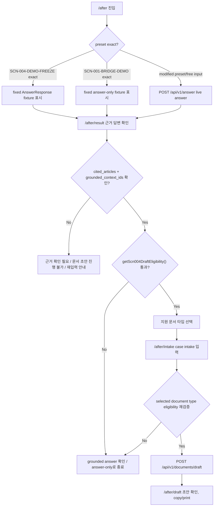

# After Requirements

- 상태: current MVP requirements
- 기준: main `frontend/` + `backend/` 현재 구현
- 관련 source of truth: `docs/specs/after/api_spec.md`, `docs/specs/after/data_model.md`

## 1. 문서 목적

이 문서는 K-Labor Shield **After** 기능의 요구정의서다. 현재 main `frontend/` Next.js 앱과 main `backend/` FastAPI 구현을 기준으로, 법률 질의에서 근거 답변과 지원 문서 초안까지 이어지는 MVP 요구사항을 정리한다.

이 문서는 `z_before_begin/`의 Before/Begin 계약서 업로드, OCR, 계약서 review 기능을 다루지 않는다. 통합 앱(integrated Before/Bridge/After) 요구정의서도 이 문서의 범위가 아니며, 팀 merge 이후 별도 문서에서 확정한다.

현재 문서는 팀 통합 전 After MVP 기준 문서다. integrated 요구정의서는 Before/Begin, Bridge, After contract가 실제로 연결된 뒤 재작성/확정한다.

## 2. 제품/사용자 배경

After 사용자는 이미 사건이나 상담 상황을 가지고 있고, 본인의 진술에 대해 법령 근거 기반 답변을 받은 뒤, 지원되는 경우 제출 전 검토용 문서 초안으로 이어가려는 사람이다. 현재 MVP의 중심 시나리오는 **SCN-004 임금체불/부당해고 관련 After flow**다.

`SCN-004-DEMO-FREEZE`는 main demo와 document draft freeze를 위한 preset이다. exact preset path에서는 fixed `AnswerResponse` fixture를 사용해 발표 재현성을 우선한다. Fixed `AnswerResponse`-like payload source는 `frontend/src/lib/scenarioPresetAnswers.json`이고, `supportsDraft`, `recommendedTopK`, `fixedAnswer` 연결 metadata owner는 `frontend/src/lib/scenarioPresets.ts`다. `SCN-001-BRIDGE-DEMO`는 Before/Bridge handoff 설명용 answer-only preset이며, 현재 After MVP에서 draft flow로 이어지지 않는다.

After MVP는 최종 법률 자문, 위법성 확정 판단, 소송 자동화가 아니다. 사용자가 제공한 사실과 검색된 법령 근거를 바탕으로 설명과 문서 초안 작성을 보조하는 제품이다.

## 3. 현재 MVP 범위

| Area | Current MVP behavior |
|---|---|
| Entry | `/after`에서 질문 입력, SCN preset 선택, free input 입력을 제공한다. |
| Fixed preset | `SCN-004-DEMO-FREEZE` exact preset은 `frontend/src/lib/scenarioPresetAnswers.json`의 fixed `AnswerResponse`-like fixture를 사용하고 `/api/v1/answer`를 호출하지 않는다. |
| Answer-only preset | `SCN-001-BRIDGE-DEMO`는 Before/Bridge handoff 설명용 answer-only preset이며 draft flow로 가지 않는다. |
| Live answer | modified preset과 free input은 `POST /api/v1/answer`를 호출할 수 있다. |
| Retrieval API | `/api/v1/retrieve`는 별도 public retrieval endpoint로 존재한다. |
| Shared retrieval | `/api/v1/answer`는 public `/api/v1/retrieve` endpoint를 HTTP로 재호출하지 않고 shared retrieval service를 직접 사용한다. |
| Result guard | `/after/result`는 `cited_articles`, `grounded_context_ids`, `getScn004DraftEligibility()` 기준으로 draft 가능 여부를 판단한다. |
| Intake | `/after/intake`는 지원되는 문서 타입과 사용자 입력을 모아 `POST /api/v1/documents/draft`로 전송한다. |
| Draft backend | `/api/v1/documents/draft`는 deterministic draft builder이며 Vertex AI, retrieval, answer_generation을 호출하지 않는다. |
| Draft result | `/after/draft`는 `rendered_text`, `missing_fields`, `cautions`, `evidence_checklist`, `cited_articles`, `source_context_ids`, copy/print를 제공한다. |

## 4. 제외 범위 / Non-goals

- Before/Begin 계약서 업로드, OCR, 계약서 review는 이 문서 범위가 아니다.
- integrated Before/Bridge/After 앱 요구사항은 팀 merge 후 별도 확정한다.
- SCN-005 frontend 문서 타입 확장은 현재 MVP scope 밖이다.
- self-hosted LLM 또는 GCP GPU 운영은 현재 After MVP 요구사항이 아니다.
- `/api/v1/answer` contract를 문서 초안 용도로 확장하지 않는다.
- browser storage에 raw `user_statement`, `answer_response`, `case_intake`, `draft_response`를 저장하지 않는다.
- draft는 사용자가 입력하지 않은 사실을 생성하거나 단정하지 않는다.
- 완전한 법률 자문, 법률대리, 소송 자동화, 실제 제출 기능을 제공하지 않는다.

## 5. 사용자 플로우

1. 사용자는 `/after`에 진입한다.
2. preset을 선택하거나 free input을 입력한다.
3. exact fixed preset이면 fixture answer를 표시한다.
4. modified preset 또는 free input이면 live answer API를 호출한다.
5. `/after/result`에서 grounded answer, key points, cautions, cited articles를 확인한다.
6. `hasDraftGrounding(answer)`가 false인 ungrounded 상태는 answer/key points/cautions 본문을 표시하지 않고, “근거 확인 필요” 및 “문서 초안 진행 불가” 경고와 재입력 안내를 보여준다.
7. grounded answer이지만 SCN-004 document-type eligibility가 없는 unsupported 상태는 답변 자체는 확인 가능하지만 draft flow로 가지 않고 answer-only로 종료한다.
8. draft eligibility guard를 통과하면 문서 타입을 선택하고 `/after/intake`로 이동한다.
9. `/after/intake`에서 case intake를 입력한다. 빈 필드는 허용되며 draft의 `missing_fields`로 남을 수 있다.
10. `/after/intake` submit 직전에 selected document type eligibility를 재검증하고, false이면 `fetchDraft()`를 호출하지 않는다.
11. `/api/v1/documents/draft`를 호출한다.
12. `/after/draft`에서 문서 초안을 확인하고 copy/print를 사용할 수 있다.

## 6. 기능 요구사항

| Requirement ID | 설명 | 현재 구현 상태 | 주요 route/API/data | 비고/TODO |
|---|---|---|---|---|
| AF-FR-001 | After entry는 사용자가 한국어 사건 진술을 입력하거나 preset을 선택할 수 있어야 한다. | 구현됨 | `/after`, `SCENARIO_PRESETS`, `FlowState.user_statement` | 10자 미만 입력은 soft warning과 disabled CTA로 처리한다. |
| AF-FR-002 | `SCN-004-DEMO-FREEZE` exact preset은 fixed answer fixture를 사용해야 한다. | 구현됨 | `/after`, `scenarioPresetAnswers.json`, `preset.fixedAnswer` | exact path는 `/api/v1/answer`를 호출하지 않는다. |
| AF-FR-003 | modified preset과 free input은 live answer API를 호출할 수 있어야 한다. | 구현됨 | `fetchAnswer()`, `POST /api/v1/answer`, `AnswerRequest` | preset modified는 `top_k=10`, free input은 `top_k=5`, 공통 `ef_search=100`. |
| AF-FR-004 | public retrieve API는 query embedding 기반 법령 chunk search 결과를 반환해야 한다. | 구현됨 | `POST /api/v1/retrieve`, `RetrievalResponse` | 현재 shared frontend API client는 직접 호출하지 않는다. |
| AF-FR-005 | answer API는 public retrieve endpoint를 HTTP로 재호출하지 않고 shared retrieval service를 직접 사용해야 한다. | 구현됨 | `answer_question()`, `retrieve_law_chunks()` | 상세 call path는 `after/api_spec.md`를 따른다. |
| AF-FR-006 | result 화면은 grounded answer, key points, cautions, cited articles를 표시해야 한다. | 구현됨 | `/after/result`, `AnswerResponse` | `cited_articles` 또는 `grounded_context_ids`가 없으면 answer/key points/cautions 본문을 표시하지 않고 no-answer/no-draft guard를 적용한다. |
| AF-FR-007 | draft eligibility guard는 grounding과 SCN-004 evidence pattern을 모두 확인해야 한다. | 구현됨 | `hasDraftGrounding()`, `getScn004DraftEligibility()` | `hasDraftGrounding()`만으로는 충분하지 않다. |
| AF-FR-008 | 지원되는 document type만 선택지로 보여야 한다. | 구현됨 | `/after/result`, `DocumentType` | 현재 frontend 노출은 `labor_office_wage_complaint`, `labor_commission_unfair_dismissal_brief` 두 가지다. |
| AF-FR-009 | `SCN-001-BRIDGE-DEMO`는 fixed/live 여부와 관계없이 answer-only로 처리해야 한다. | 구현됨 | `supportsDraft=false`, `/after/result` | Before/Bridge handoff 설명용이며 SCN-001 document type 구현이 아니다. |
| AF-FR-010 | case intake는 문서 타입별 사실관계와 증거 입력을 수집해야 한다. | 구현됨 | `/after/intake`, `CaseIntakeFormValues`, `buildCaseIntake()` | 연락처, 계좌번호, 외국인등록번호 등 직접 식별 정보는 필수 수집하지 않는다. |
| AF-FR-011 | intake submit은 `buildLegalBasis()`와 `buildCaseIntake()` 결과만 draft endpoint에 보내야 한다. | 구현됨 | `DocumentDraftRequest`, `LegalBasisInput`, `CaseIntake` | `LegalBasisInput.retrieved_chunks`는 grounded context id에 포함된 chunk만 전달한다. `/after/intake` submit 직전에 selected document type eligibility를 재검증하고, false이면 `fetchDraft()`를 호출하지 않는다. |
| AF-FR-012 | document draft generation은 deterministic backend builder로 동작해야 한다. | 구현됨 | `POST /api/v1/documents/draft`, `build_document_draft()` | Vertex/retrieval/answer_generation 호출 금지. |
| AF-FR-013 | draft result는 structured sections와 `rendered_text`를 표시해야 한다. | 구현됨 | `/after/draft`, `DocumentDraftResponse` | `missing_fields`, `cautions`, `evidence_checklist`, `cited_articles`, `source_context_ids` 포함. |
| AF-FR-014 | draft result는 copy와 browser print를 제공해야 한다. | 구현됨 | `/after/draft`, `navigator.clipboard`, `window.print()` | copy text에는 제출 전 검토용 disclaimer가 붙는다. |
| AF-FR-015 | flow state는 memory-only여야 한다. | 구현됨 | `FlowContext`, `useReducer`, `FlowState` | refresh/direct URL에서 state가 유실될 수 있다. |
| AF-FR-016 | loading/error state는 answer와 draft API 호출 모두에서 사용자에게 표시되어야 한다. | 구현됨 | `/after`, `/after/intake`, `ApiError` | error copy는 `fetchAnswer()`/`fetchDraft()` mapping을 따른다. |
| AF-FR-017 | privacy/storage guard는 raw payload의 Web Storage 저장을 금지해야 한다. | 구현됨/정책화됨 | `frontend/src`, `FlowState` | `localStorage`, `sessionStorage`, IndexedDB에 raw payload를 저장하지 않는다. |
| AF-FR-018 | ungrounded answer는 no-answer/no-draft guard로 막고, grounded but unsupported answer는 draft flow 없이 answer-only로 남겨야 한다. | 구현됨 | `/after/result`, `/after/intake` route guard | ungrounded는 “근거 확인 필요”/“문서 초안 진행 불가” 경고와 재입력 안내를 보여주며 답변 본문을 숨긴다. unsupported but grounded 상태는 답변 확인은 가능하지만 SCN-004 draft flow로 가지 않는다. |

## 7. 비기능 요구사항

| Requirement ID | 설명 | 현재 기준 |
|---|---|---|
| AF-NFR-001 | demo freeze stability | `SCN-004-DEMO-FREEZE` exact preset은 fixed fixture로 동작해 live model drift와 provider availability 영향을 피한다. |
| AF-NFR-002 | grounded legal citations | 법률 답변은 retrieved/grounded context 안의 조문만 인용해야 하며 `cited_articles`와 `grounded_context_ids`가 필요하다. |
| AF-NFR-003 | Vertex usage boundary | `/api/v1/retrieve`와 live `/api/v1/answer`는 Vertex AI Gemini path를 사용할 수 있음을 명확히 표시한다. |
| AF-NFR-004 | draft no-Vertex boundary | `/api/v1/documents/draft`는 Vertex AI, retrieval, answer_generation을 호출하지 않는다. |
| AF-NFR-005 | privacy/browser storage boundary | raw `user_statement`, `answer_response`, `case_intake`, `draft_response`는 Web Storage에 저장하지 않는다. |
| AF-NFR-006 | deterministic draft behavior | draft는 request의 `case_intake`와 `legal_basis`만 사용해 deterministic output을 만든다. |
| AF-NFR-007 | schema/API compatibility | endpoint contract 상세는 `after/api_spec.md`를 source of truth로 두고 임의 확장하지 않는다. |
| AF-NFR-008 | Korean-first UI | 사용자 주요 화면 문구는 한국어를 우선하고 영어는 보조 label 수준으로 유지한다. |
| AF-NFR-009 | print/copy usability | `rendered_text`는 copy와 browser print에 적합해야 하며, 제출 전 검토용 disclaimer를 유지한다. |
| AF-NFR-010 | error handling | answer/draft 호출 실패, direct URL access, unsupported answer, ungrounded no-answer/no-draft 상태를 사용자가 복구 가능한 방식으로 처리한다. |
| AF-NFR-011 | reproducibility | demo path, fixed fixture, `top_k`/`ef_search` 규칙, SCN-004 eligibility guard를 유지해 제출 전 재현성을 보장한다. |

## 8. Privacy / Vertex / Draft Boundary

`/api/v1/retrieve`는 기본적으로 사용자 query를 Vertex `gemini-embedding-001` query embedding으로 보낼 수 있다. 이 endpoint는 public retrieval endpoint이며, response는 `RetrievalResponse` shape를 따른다.

`/api/v1/answer`는 modified preset 또는 free input의 사용자 query를 Vertex embedding과 Gemini answer generation으로 보낼 수 있다. 기본 answer model은 현재 `gemini-2.5-flash`이며, public `AnswerRequest`에는 `model_name` field가 없다.

`SCN-004-DEMO-FREEZE` exact preset은 fixed fixture를 사용하고 `/api/v1/answer`를 호출하지 않는다. 따라서 exact preset path 자체는 live Vertex query embedding 또는 Gemini answer generation을 호출하지 않는다. `SCN-001-BRIDGE-DEMO`도 fixed answer-only preset이며 draft flow로 들어가지 않는다.

`/api/v1/documents/draft`는 Vertex AI, retrieval service, answer_generation service를 호출하지 않는다. 이 endpoint는 request의 `legal_basis`와 `case_intake`만 사용한다. 단, `legal_basis`는 이전 live `/api/v1/answer` 호출 결과에서 유래했을 수 있으므로, modified/free input answer path에서 이미 Vertex를 사용했을 수 있다.

frontend flow state는 React Context + `useReducer` memory-only다. raw `user_statement`, `answer_response`, `case_intake`, `draft_response`는 Web Storage(`localStorage`, `sessionStorage`, IndexedDB)에 저장하지 않아야 한다.

## 9. API 요구사항 요약

API 상세 schema와 status code는 `docs/specs/after/api_spec.md`를 source of truth로 한다.

| Method | Path | 역할 |
|---|---|---|
| `POST` | `/api/v1/retrieve` | 사용자 query를 embedding하고 PostgreSQL/pgvector `law_chunks` 검색 결과를 반환한다. |
| `POST` | `/api/v1/answer` | shared retrieval service 결과를 바탕으로 grounded legal answer를 생성한다. public `/api/v1/retrieve` endpoint를 HTTP로 재호출하지 않는다. |
| `POST` | `/api/v1/documents/draft` | `case_intake`와 `legal_basis`만 사용해 deterministic document draft를 생성한다. |

요구정의서에서는 endpoint 역할만 요약한다. `RetrievalRequest`, `AnswerRequest`, `DocumentDraftRequest`, response field, error/status detail은 `after/api_spec.md`를 따른다.

## 10. 데이터/저장 요구사항 요약

데이터 모델 상세는 `docs/specs/after/data_model.md`를 source of truth로 한다.

| Data area | 요구사항 요약 |
|---|---|
| LawChunk / corpus | `law_chunks.chunk_id`가 primary key이며, embedding은 pgvector `Vector(768)`이다. current source of truth는 `backend/data/law_chunks/all_chunks.json`이다. |
| RetrievalResponse | public `/api/v1/retrieve` chunk에는 `context_id`가 없고 `similarity`가 있다. |
| AnswerResponse | `/api/v1/answer`의 `retrieved_chunks`는 `GroundedChunkResult`이며 1-based `context_id`가 붙는다. |
| FlowState | `KLaborShieldFlowState`는 memory-only runtime state이며 Web Storage persistence를 하지 않는다. |
| Fixed fixture | `frontend/src/lib/scenarioPresetAnswers.json`은 presentation-local fixed `AnswerResponse`-like payload 저장소다. `supportsDraft`, `recommendedTopK`, `fixedAnswer` 연결은 `frontend/src/lib/scenarioPresets.ts` metadata이며 fixture JSON field가 아니다. |
| Draft request | `CaseIntake`와 `LegalBasisInput`만 draft endpoint request로 보낸다. |
| Draft response | `DocumentDraftResponse`는 `rendered_text`, structured sections, `missing_fields`, `cautions`, `evidence_checklist`, `cited_articles`, `source_context_ids`를 포함한다. |
| `source_context_ids` | response-level fallback semantics는 `after/data_model.md`로 위임한다. 이 값을 citation별 retrieved chunk mapping과 혼동하면 안 된다. |

## 11. 현재 알려진 제약/TODO

- TODO: raw payload logging policy 점검 필요. app-level retrieve/answer logs는 `query_hash`를 사용하지만 access log, proxy log, runtime log, provider log 정책은 별도 확인이 필요하다.
- TODO: fixed fixture vs live answer drift 가능성이 있다. `SCN-004-DEMO-FREEZE` exact path는 frozen fixture이고, modified/free input은 live answer path다.
- TODO: FlowState memory-only라 refresh/direct URL에 취약하다. 현재는 route guard redirect가 기대 동작이다.
- TODO: `source_context_ids` response-level fallback 의미를 citation mapping과 혼동하면 안 된다.
- TODO: `getScn004DraftEligibility()` guard 유지 필요. grounding만으로 지원 문서 타입 evidence가 보장되지 않는다.
- TODO: SCN-005 문서 타입 확장은 후속 별도 작업이다.
- TODO: integrated docs는 팀 merge 후 재작성/확정한다.
- TODO: local/self-hosted LLM은 현재 After data model/API 범위 밖이다.
- TODO: public `AnswerRequest.model_name` 노출 여부는 backend/schema review 후 결정한다.
- TODO: frontend direct `/api/v1/retrieve` client/type mirror가 필요하면 별도 review 후 추가한다.

## 12. Acceptance Criteria

demo/local 기준 체크리스트:

- [ ] exact `SCN-004-DEMO-FREEZE` preset은 fixed answer fixture로 작동하고 `/api/v1/answer`를 호출하지 않는다.
- [ ] modified preset과 free input은 live answer path로 작동 가능하다.
- [ ] answer result에 `cited_articles`와 `grounded_context_ids`가 표시되거나 draft eligibility 판단에 사용된다.
- [ ] ungrounded answer는 answer/key points/cautions 본문을 표시하지 않고 “근거 확인 필요” 및 “문서 초안 진행 불가” no-answer/no-draft guard와 재입력 안내를 보여준다.
- [ ] grounded but unsupported answer는 답변 확인은 가능하지만 draft flow를 막고 answer-only로 남는다.
- [ ] supported SCN-004 answer는 `getScn004DraftEligibility()`를 통과한 문서 타입만 표시한다.
- [ ] `/after/intake` submit 직전에 selected document type eligibility를 재검증하고, false이면 `fetchDraft()`를 호출하지 않는다.
- [ ] intake 입력 후 deterministic draft 생성이 가능하다.
- [ ] draft result가 `rendered_text`, `missing_fields`, `cautions`, `evidence_checklist`, `cited_articles`, `source_context_ids`를 표시한다.
- [ ] copy/print 동작이 가능하다.
- [ ] browser storage에 raw payload를 저장하지 않는다.
- [ ] draft endpoint no-Vertex boundary가 문서와 구현 경계에서 명확하다.
- [ ] Before/Begin과 After 범위가 혼동되지 않는다.
