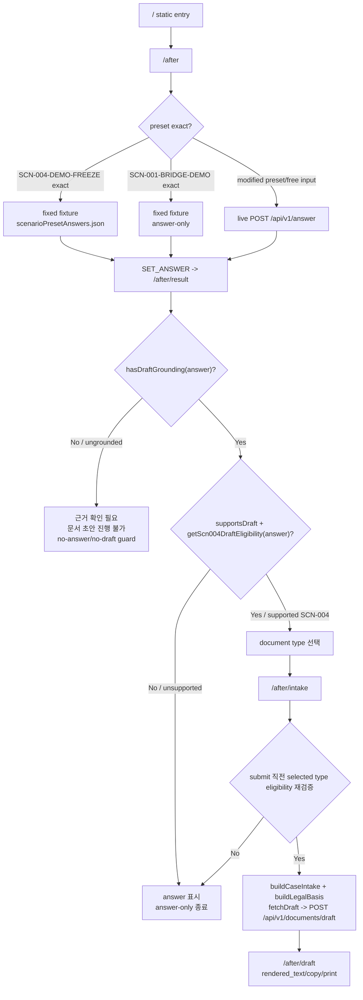

# After Screen Plan

- 상태: current implementation-based screen plan
- 기준: main `frontend/src/app` After routes + `docs/specs/after/requirements.md`, `api_spec.md`, `data_model.md`
- 범위: main `frontend/`의 After 화면 기획. `z_before_begin/` Before/Begin 화면과 future integrated 화면은 별도 문서 범위다.

## 1. 문서 목적

이 문서는 K-Labor Shield **After 화면 기획서**다. 새 UI 제안서가 아니라 현재 main `frontend/src/app`에 구현된 After route, 화면 상태, 사용자 액션, API 호출, 표시 데이터를 코드 기준으로 정리한다.

기준 route는 `/`, `/after`, `/after/result`, `/after/intake`, `/after/draft`다. `z_before_begin/`의 Before/Begin 계약서 업로드, OCR, review 화면과 팀 통합 후 integrated Before/Bridge/After 화면은 이 문서에서 다루지 않는다. integrated screen plan은 팀 merge 후 별도 문서에서 다시 작성한다.

## 2. 화면/Route 범위 요약

| Route | 역할 | 주요 state/input | 호출 API 여부 | 다음 이동 | 구현 상태 |
|---|---|---|---|---|---|
| `/` | 앱 entry/scaffold 화면. 현재 static home copy와 기본 프로젝트 상태를 표시한다. | route-local static content only | 없음 | 직접 URL 접근 또는 shared nav가 있는 화면에서 `/after`로 진입 | 구현됨. 단, home 본문 자체 CTA는 없음 |
| `/after` | After 질문 입력, preset 선택, fixed fixture 또는 live answer 실행 | component `statement`, `selectedPresetId`; `FlowContext.user_statement`, `selected_preset_id` | exact preset은 없음. modified preset/free input은 `POST /api/v1/answer` | answer 저장 후 `/after/result` | 구현됨 |
| `/after/result` | grounded answer 표시, ungrounded/no-draft guard, SCN-004 draft document type 선택 | `answer_response`, `selected_document_type`, preset metadata | 없음 | supported SCN-004 document type 선택 후 `/after/intake`; reset은 `/after` | 구현됨 |
| `/after/intake` | selected document type별 case intake 입력, submit 직전 eligibility 재검증, draft 생성 | `answer_response`, `selected_document_type`, form local state, `case_intake_form`, `case_intake`, `legal_basis` | `POST /api/v1/documents/draft` via `fetchDraft()` | draft 저장 후 `/after/draft`; invalid state는 `/after` 또는 `/after/result` | 구현됨 |
| `/after/draft` | deterministic draft result 표시, copy, browser print | `draft_response`; `answer_response`는 back navigation/guard context only | 없음 | `/after/intake`, `/after/result`, `/after` | 구현됨 |

## 3. 사용자 플로우

현재 main flow는 `/`에서 앱 scaffold를 확인하거나, 직접 URL 접근 또는 shared nav가 있는 화면에서 `/after`에 진입하는 흐름이다. 실제 상담/문서 흐름은 `/after`부터 시작한다.

1. 사용자는 `/after`에서 preset을 선택하거나 free input을 입력한다.
2. exact `SCN-004-DEMO-FREEZE` preset이면 `frontend/src/lib/scenarioPresetAnswers.json`의 fixed `AnswerResponse`-like payload를 사용하고 `/api/v1/answer`를 호출하지 않는다.
3. exact `SCN-001-BRIDGE-DEMO` preset도 fixed fixture를 사용하지만 answer-only preset이므로 draft flow로 가지 않는다.
4. preset 문구를 수정했거나 free input이면 `fetchAnswer()`가 live `POST /api/v1/answer`를 호출한다.
5. `/after/result`에서 answer/result를 확인한다.
6. `hasDraftGrounding(answer)`가 false인 ungrounded 상태이면 answer/key_points/cautions 본문을 표시하지 않고 “근거 확인 필요” 및 “문서 초안 진행 불가” no-answer/no-draft guard와 재입력 안내를 보여준다.
7. grounded but unsupported 상태이면 answer는 표시하지만 draft CTA/document type 선택지는 없거나 비활성이다. 이 상태는 answer-only로 종료한다.
8. grounded + supported SCN-004 상태이면 `getScn004DraftEligibility(answer)`가 true로 표시한 document type만 선택할 수 있고, 선택 후 `/after/intake`로 이동한다.
9. `/after/intake`는 이전 route에서 `FlowContext.selected_document_type`으로 받은 document type에 맞는 form을 보여준다.
10. submit 직전 `getScn004DraftEligibility(answer)`를 다시 실행해 selected document type eligibility를 재검증한다. false이면 `fetchDraft()`를 호출하지 않는다.
11. submit 가능하면 `buildCaseIntake()`와 `buildLegalBasis()` 결과만 `POST /api/v1/documents/draft`에 보낸다.
12. `/after/draft`에서 `rendered_text`, `cautions`, `missing_fields`, `evidence_checklist`, `cited_articles`, `source_context_ids`를 확인하고 copy/print를 사용한다.

## 4. Route별 상세 화면 기획

### `/`

| 항목 | 내용 |
|---|---|
| 표시 목적 | K-Labor Shield frontend scaffold/entry 상태를 표시한다. After 기능의 실제 입력 화면은 `/after`다. |
| 주요 UI 영역 | static main section, eyebrow `SCN-004 Phase 1A`, title, body copy. `Masthead`는 이 page 안에서 렌더링되지 않지만 다른 After routes의 shared nav에는 `/after` 링크가 있다. |
| 주요 사용자 액션 | 현재 page body에는 CTA/action 없음. 사용자는 주소 입력 또는 shared nav가 있는 화면에서 `/after`로 진입한다. |
| 사용 state/props/context | 없음. `FlowContext`를 읽지 않는다. |
| API 호출 | 없음. |
| validation/guard | 없음. |
| loading/error/empty state | 없음. |
| 다음 route | 구현상 자동 이동 없음. 사용자 flow 기준 다음 작업 route는 `/after`. |
| TODO/제약 | home 본문에서 `/after`로 보내는 명시적 CTA는 현재 구현되어 있지 않다. 이 문서는 새 CTA를 제안하지 않고 현 구현을 기록한다. |

### `/after`

| 항목 | 내용 |
|---|---|
| 표시 목적 | 사용자가 노동권 상황을 한국어로 입력하거나 demo preset을 선택하고, fixed fixture 또는 live answer path로 결과를 만든다. |
| 주요 UI 영역 | `Masthead`, intro band, Step 1 상황 입력 form, character counter, textarea, preset button row, answer error `Notification`, submit button, `DisclaimerBanner`. |
| 주요 사용자 액션 | textarea 입력, `SCN-001-BRIDGE-DEMO`/`SCN-004-DEMO-FREEZE` preset 선택, `법 조문 찾기` submit, retryable error 재시도. |
| 사용 state/props/context | component state: `statement`, `selectedPresetId`, `isLoading`, `errorState`. `FlowContext`: `SET_STATEMENT`, `SET_ANSWER`; existing `state.user_statement`, `state.selected_preset_id`를 초기값으로 사용. |
| API 호출 | exact preset query면 `preset.fixedAnswer`를 사용해 API 호출 없음. modified preset/free input이면 `fetchAnswer(payload)`가 `POST /api/v1/answer`를 호출한다. |
| validation/guard | trimmed statement 10자 미만이면 helper warning과 disabled submit. duplicate submit은 `answerSubmittingRef`로 방지. preset metadata가 있으면 `recommendedTopK`, 아니면 free input default `top_k=5`; 항상 `ef_search=100`. |
| loading/error/empty state | live answer 호출 중 `Masthead` progress와 submit loading. `ApiError`는 `법 조문 검색 실패` notification으로 표시하고 retryable이면 같은 payload로 재시도 가능. 빈 입력/짧은 입력은 submit disabled. |
| 다음 route | answer 저장 후 `router.push('/after/result')`. |
| TODO/제약 | exact fixed path와 live answer wording drift가 생길 수 있다. `/api/v1/retrieve` direct client는 현재 없다. |

### `/after/result`

| 항목 | 내용 |
|---|---|
| 표시 목적 | grounded answer와 citations를 표시하고, SCN-004 document draft로 갈 수 있는지 분기한다. |
| 주요 UI 영역 | Step 2 summary band, answer/result column, answer details, key points, cautions, cited articles, state-specific `Notification`, document type selector aside, reset button, `DisclaimerBanner`. |
| 주요 사용자 액션 | eligible document type tile 선택, keyboard Enter/Space 선택, `사건 정보 입력하기`로 `/after/intake` 이동, `처음으로 돌아가기` reset. |
| 사용 state/props/context | `answer_response`, `user_statement`, `selected_preset_id`, `selected_document_type`. `getScenarioPreset()`로 `supportsDraft` 확인. `SET_DOCUMENT_TYPE`, `RESET` dispatch. |
| API 호출 | 없음. |
| validation/guard | `answer_response`가 없으면 `/after`로 replace. `hasDraftGrounding(answer)`는 `cited_articles.length > 0` AND `grounded_context_ids.length > 0` 확인. `getScn004DraftEligibility(answer)`는 wage/dismissal evidence pattern으로 SCN-004 document type availability를 계산. |
| loading/error/empty state | missing answer direct URL은 `처음 단계로 이동합니다.` 표시 후 redirect. navigating 중 draft CTA loading. answer body/key_points/cautions empty list fallback text 있음. |
| 다음 route | selected document type이 available이고 grounded/supported이면 `/after/intake`. reset은 `/after`. |
| TODO/제약 | ungrounded와 unsupported UI 상태를 계속 분리해야 한다. `SCN-001-BRIDGE-DEMO`는 answer-only 설명용이며 document type selector를 열지 않는다. |

`/after/result` 상태 분기는 다음처럼 고정한다.

| 상태 | 조건 | 화면 동작 |
|---|---|---|
| grounded + supported SCN-004 document type | `hasDraftGrounding(answer) === true`, preset `supportsDraft !== false`, `getScn004DraftEligibility(answer)`가 하나 이상의 document type true | answer/key_points/cautions/citations 표시. eligible document type tile과 draft CTA 활성 가능. |
| grounded but unsupported | `hasDraftGrounding(answer) === true`, 그러나 `supportsDraft=false` 또는 eligible SCN-004 document type 없음 | answer/key_points/cautions/citations 표시. draft CTA 없음 또는 비활성. answer-only로 종료. |
| ungrounded | `hasDraftGrounding(answer) === false` | answer/key_points/cautions 본문을 표시하지 않음. “근거 확인 필요”와 “문서 초안 진행 불가” warning 표시. citation section은 현재 response의 `cited_articles` 유무에 따라 empty/label 표시. 재입력 안내 후 `/after`로 돌아가게 한다. |
| `SCN-001-BRIDGE-DEMO` | active preset `supportsDraft=false` | fixed/live 여부와 관계없이 answer-only. SCN-004 draft flow로 가지 않는다. |

`hasDraftGrounding()`과 `getScn004DraftEligibility()`의 역할은 다르다. `hasDraftGrounding()`은 draft flow를 시작하기 위한 최소 grounding check이고, `getScn004DraftEligibility()`는 grounded answer가 현재 frontend에서 지원하는 SCN-004 문서 타입 근거 패턴을 갖는지 확인한다. grounding만으로 문서 타입 지원을 보장하지 않는다.

### `/after/intake`

| 항목 | 내용 |
|---|---|
| 표시 목적 | 선택된 SCN-004 document type에 필요한 사건 정보를 선택 입력받고 deterministic draft request를 만든다. |
| 주요 UI 영역 | Step 3 header, selected document badge, wage complaint form 또는 unfair dismissal form, 사건 경위 row editor, 증거 목록 row editor, `DisclaimerBanner`, sticky submit bar, draft error `Notification`. |
| 주요 사용자 액션 | optional case facts 입력, timeline row 추가/삭제, evidence row 추가/삭제, `문서 초안 생성하기`, retryable draft error 재시도, `처음으로 돌아가기` reset. |
| 사용 state/props/context | `answer_response`, `selected_document_type`, `case_intake_form`, `case_intake`. local state: `formValues`, `incidentTimeline`, `evidenceItems`, `isSubmitting`, `errorState`. dispatch: `SET_LEGAL_BASIS`, `SET_CASE_INTAKE_FORM`, `SET_CASE_INTAKE`, `SET_DRAFT`, `RESET`. |
| API 호출 | submit 가능할 때 `fetchDraft({ case_intake, legal_basis })`가 `POST /api/v1/documents/draft`를 호출한다. |
| validation/guard | missing answer면 `/after`; no grounding/no selected type/not eligible이면 `/after/result`. submit 직전 `hasDraftGrounding(answer)`, preset `supportsDraft`, `getScn004DraftEligibility(answer).documentTypes[selectedDocumentType]`를 다시 확인한다. false이면 `fetchDraft()`를 호출하지 않는다. |
| loading/error/empty state | invalid state는 `이전 단계로 이동합니다.` 표시 후 redirect. submit 중 form content disabled와 loading. `fetchDraft` 실패는 `문서 초안 생성 실패` notification으로 표시하고 retryable이면 재시도 가능. |
| 다음 route | draft 저장 후 `/after/draft`. invalid state는 `/after` 또는 `/after/result`. |
| TODO/제약 | 입력하지 않은 사실은 frontend에서 생성하지 않고 draft service가 placeholder/missing_fields로 남긴다. 개인정보 직접 식별 정보는 필수 수집하지 않는다. |

selected document type은 `/after/result`에서 `SET_DOCUMENT_TYPE`으로 `FlowContext.selected_document_type`에 저장된다. `/after/intake`는 URL query나 Web Storage가 아니라 이 memory state를 읽는다.

document type별 주요 입력 영역:

| Document type | Form | 주요 입력 |
|---|---|---|
| `labor_office_wage_complaint` | `WageComplaintForm` | 당사자 정보, 국적/선호 언어, 회사/대표자/관할, 입사일/마지막 근무일/직무, 임금 형태/조건/지급일, 근로계약서/1년 이상 여부, 미지급 임금/퇴직금 금액, 체불 기간, 14일 경과, 지급 여부, 추가 메모 |
| `labor_commission_unfair_dismissal_brief` | `UnfairDismissalForm` | 당사자 정보, 5인 이상 여부, 입사일/마지막 근무일/직무, 해고 통지일/효력 발생일/통지 방식, 서면 수령 여부, 원직복직/금전보상, 30일 전 예고, 해고 사유 설명, 해고 경위 메모, 추가 메모 |
| 공통 | `EvidenceSection` | 사건 경위 timeline, 증거 종류/설명/확보 상태. 빈 행은 `buildCaseIntake()` 전에 제외된다. |

`buildCaseIntake()`는 current frontend에서 `scenario_id='SCN-004'`, `language='ko'`, selected document type, cleaned optional facts, derived `claims`, derived `requested_actions`, filtered evidence/timeline을 만든다. `buildLegalBasis()`는 `AnswerResponse`에서 `answer_query`, `answer`, `key_points`, `cautions`, `cited_articles`, `source_context_ids`, grounded `retrieved_chunks`만 뽑아 draft boundary로 넘긴다.

### `/after/draft`

| 항목 | 내용 |
|---|---|
| 표시 목적 | deterministic draft builder 결과를 검토하고 copy/print한다. |
| 주요 UI 영역 | Step 4 header, document type badge, recipient meta, screen disclaimer, copy/print action group, `DocumentPreview`, side panels: missing fields, cautions, evidence checklist, legal basis/source ids, bottom action bar. |
| 주요 사용자 액션 | `초안 복사하기`, `인쇄하기`, evidence checklist local status 변경, `다른 문서 타입으로 생성하기`, `사건 정보 수정하기`, `처음으로 돌아가기`. |
| 사용 state/props/context | `state.draft_response`가 주 데이터 source다. `state.answer_response`는 `다른 문서 타입으로 생성하기` back navigation/guard에서만 확인한다. `case_intake`, `case_intake_form`은 FlowState에는 남아 있을 수 있으나 이 화면이 직접 읽는 주 데이터는 아니다. dispatch: `RESET`, deferred `CLEAR_DRAFT`, deferred `CLEAR_DRAFT_AND_CASE_INTAKE`. |
| API 호출 | 없음. |
| validation/guard | `draft_response`가 없으면 `/after`로 replace. `rendered_text.trim()`이 없으면 copy/print disabled 또는 no-op. |
| loading/error/empty state | missing draft direct URL은 `처음 단계로 이동합니다.` 표시 후 redirect. copy success/error feedback은 `aria-live` copy status text로 표시. empty panels have fallback text. |
| 다음 route | case 수정은 `/after/intake` with deferred `CLEAR_DRAFT`; 다른 문서 타입은 `/after/result` with deferred `CLEAR_DRAFT_AND_CASE_INTAKE` if answer exists; reset은 `/after`. |
| TODO/제약 | `source_context_ids`는 response-level fallback일 수 있으므로 citation-level 1:1 mapping이라고 단정하지 않는다. PDF download/actual submission은 현재 범위 밖이다. |

`/after/draft` 표시 데이터:

| Response field | 표시 위치 / 동작 |
|---|---|
| `rendered_text` | `DocumentPreview` 본문. `[...확인 필요...]` placeholder는 preview에서 강조된다. |
| `missing_fields` | `MissingFieldsPanel`; 없으면 추가 확인 항목 없음 표시. |
| `cautions` | `CautionsPanel`; base cautions + prior answer cautions + deterministic cautions. |
| `evidence_checklist` | `EvidenceChecklist`; checklist UI status는 component local `useState`로 관리한다. `evidence_status_map`/`SET_EVIDENCE_STATUS`를 사용하지 않는다. |
| `cited_articles` | `LegalBasisPanel` citation pills. |
| `legal_basis` | citation label + summary list. |
| `source_context_ids` | `LegalBasisPanel` details/debug text. response-level fallback 가능. |
| `missing_legal_basis` | 추가 법적 근거 확인 필요 list. |

copy는 `navigator.clipboard.writeText(rendered_text + COPY_DISCLAIMER)`를 사용한다. print는 `window.print()`를 호출한다. 화면/인쇄용 disclaimer는 “제출 전 검토용 초안” 경계를 유지한다.

## 5. FlowContext / Memory State

After state는 `frontend/src/context/FlowContext.tsx`의 React Context + `useReducer` memory-only state다. `frontend/src/app/layout.tsx`가 `FlowProvider`로 앱을 감싼다.

| FlowState field | 사용 목적 |
|---|---|
| `user_statement` | `/after` 입력/summary source |
| `selected_preset_id` | active `scenarioPresets` metadata lookup |
| `answer_response` | `/after/result`, `/after/intake` legal basis source |
| `selected_document_type` | `/after/result` 선택값, `/after/intake` guard/source |
| `legal_basis` | draft request boundary snapshot |
| `case_intake_form` | intake form values restore within memory session |
| `case_intake` | normalized draft request payload |
| `evidence_status_map` | 현재 unused/reserved reducer field. FlowContext에 `SET_EVIDENCE_STATUS` reducer/action은 있으나 current `frontend/src` 호출 경로는 없고, `/after/draft` checklist UI status는 `EvidenceChecklist` component local `useState`가 관리한다. |
| `draft_response` | `/after/draft` result source |

Storage boundary:

- raw `user_statement`, `answer_response`, `case_intake`, `draft_response`는 Web Storage에 저장하지 않는다.
- 코드 기준 `frontend/src`에서 `localStorage`, `sessionStorage`, IndexedDB 사용 경로는 확인되지 않았다.
- refresh/direct URL 접근 시 `FlowContext` memory state가 유실될 수 있다.
- 현재 복구 방식은 route guard redirect다: `/after/result` missing answer -> `/after`, `/after/intake` invalid state -> `/after` 또는 `/after/result`, `/after/draft` missing draft -> `/after`.
- sessionStorage backup/restore는 현재 제외 범위/TODO다.

## 6. Preset / Fixed Fixture 화면 동작

`SCN-004-DEMO-FREEZE` exact preset은 `frontend/src/lib/scenarioPresetAnswers.json`의 fixed `AnswerResponse`-like payload를 사용한다. `frontend/src/lib/scenarioPresets.ts`는 이 fixed answer를 `preset.fixedAnswer`로 연결하고, `supportsDraft`, `recommendedTopK`, `fixedAnswer` metadata를 소유한다.

중요 경계:

- `supportsDraft`와 `recommendedTopK`는 fixture JSON field가 아니라 `scenarioPresets.ts` metadata다.
- exact fixed path는 `/api/v1/answer`를 호출하지 않는다.
- exact fixed path는 runtime Vertex query embedding이나 Gemini answer generation을 호출하지 않는다.
- modified preset/free input은 `fetchAnswer()`를 통해 live `/api/v1/answer`를 호출할 수 있다.
- preset modified path는 `top_k=10`, `ef_search=100`이다.
- free input path는 `top_k=5`, `ef_search=100`이다.
- `SCN-001-BRIDGE-DEMO`는 `supportsDraft=false`인 answer-only preset이며 current frontend에서 draft flow로 가지 않는다.

| Preset | Exact query 동작 | Draft support | Next result behavior |
|---|---|---:|---|
| `SCN-001-BRIDGE-DEMO` | `scenarioPresetAnswers.json` fixed fixture | false | grounded answer를 표시할 수 있어도 answer-only |
| `SCN-004-DEMO-FREEZE` | `scenarioPresetAnswers.json` fixed fixture | true | SCN-004 eligibility가 통과한 document type 선택 가능 |

## 7. `/after/result` 상태 분기 상세

`/after/result`는 answer display와 draft entry를 분리해서 판단한다.

1. `hasDraftGrounding(answer)`:
   - `cited_articles.length > 0`와 `grounded_context_ids.length > 0`를 동시에 확인한다.
   - false이면 ungrounded로 본다.
   - ungrounded에서는 answer/key_points/cautions 본문을 표시하지 않는다.

2. `getScn004DraftEligibility(answer)`:
   - `response.query`, `response.cited_articles`, grounded `retrieved_chunks` text에서 wage/dismissal citation/keyword pattern을 확인한다.
   - 현재 document type별 boolean은 `labor_office_wage_complaint`, `labor_commission_unfair_dismissal_brief` 두 가지다.
   - `hasDraftGrounding()`을 대체하지 않는다. grounding이 있어도 SCN-004 evidence pattern이 없으면 unsupported answer-only다.

3. preset `supportsDraft`:
   - active preset이 `SCN-001-BRIDGE-DEMO`이면 `supportsDraft=false`로 draft selector를 막는다.
   - active preset이 없으면 기본적으로 draft support를 true로 보되, `hasDraftGrounding()`과 `getScn004DraftEligibility()`가 통과해야 실제 selector가 열린다.

상태별 화면:

| 상태 | Answer 본문 | Citation | Document selector | Primary message |
|---|---|---|---|---|
| grounded + supported SCN-004 | 표시 | 표시 | eligible type만 표시 | 다음 단계에서 만들 문서를 선택 |
| grounded but unsupported | 표시 | 표시 | 표시 안 함/비활성 | 현재 문서 초안 지원 범위 밖 또는 답변 확인 전용 프리셋 |
| ungrounded | 숨김 | response에 있으면 표시, 없으면 empty | 표시 안 함/비활성 | “근거 확인 필요”, “문서 초안 진행 불가” |
| `SCN-001-BRIDGE-DEMO` | grounded면 표시 | 표시 | 표시 안 함/비활성 | 답변 확인 전용 프리셋 |

## 8. `/after/intake` 상세

`/after/intake`는 이전 route에서 `FlowContext.selected_document_type`으로 받은 selectedDocumentType을 사용한다. URL parameter나 Web Storage에서 document type을 복원하지 않는다.

submit 전 guard 순서:

1. `answer_response`가 없으면 `/after`로 redirect한다.
2. `hasDraftGrounding(answer)`가 false이면 `/after/result`로 redirect하거나 submit error를 표시한다.
3. active preset이 `supportsDraft=false`이면 submit error를 표시하고 `fetchDraft()`를 호출하지 않는다.
4. `selected_document_type`이 없으면 `/after/result`로 redirect한다.
5. submit 직전 `getScn004DraftEligibility(answer)`를 다시 실행한다.
6. `selectedEligibility.documentTypes[selectedDocumentType]`가 false이면 `fetchDraft()`를 호출하지 않고 “선택한 문서 타입을 뒷받침하는 SCN-004 근거가 없어 문서 초안을 만들 수 없습니다.” error를 표시한다.
7. 통과하면 `buildLegalBasis(answer)`와 `buildCaseIntake(input)`를 만든 뒤 `fetchDraft()`로 `POST /api/v1/documents/draft`를 호출한다.

UX boundary:

- 빈 field는 submit을 막지 않는다.
- `buildCaseIntake()`는 빈 timeline/evidence row를 제외한다.
- 사용자가 입력하지 않은 사실은 frontend나 draft service가 생성하지 않는다.
- draft service는 placeholder 또는 `missing_fields`로 확인 필요 항목을 남긴다.
- `/api/v1/documents/draft` request에는 `case_intake`와 `legal_basis`만 포함된다.

## 9. `/after/draft` 상세

`/after/draft`는 `DocumentDraftResponse`의 deterministic builder 결과를 표시한다. 이 path는 no-Vertex path이며, draft endpoint는 retrieval service나 answer_generation service를 호출하지 않는다.

주요 표시/동작:

- `rendered_text`를 `DocumentPreview`에 표시한다.
- `missing_fields`를 확인 필요 항목으로 표시한다.
- `cautions`를 주의사항으로 표시한다.
- `evidence_checklist`를 checklist로 표시하고 status는 화면 내 local state로만 관리한다.
- `cited_articles`, `legal_basis`, `missing_legal_basis`를 법적 근거 panel에 표시한다.
- `source_context_ids`를 details/debug 정보로 표시한다.
- `source_context_ids`는 response-level fallback일 수 있어 citation-level mapping과 같다고 단정하지 않는다.
- copy 버튼은 `rendered_text`에 copy disclaimer를 붙여 clipboard에 쓴다.
- browser print 버튼은 `window.print()`를 호출한다.
- 화면과 print output에는 제출 전 검토용 disclaimer가 포함된다.

Back navigation:

- `사건 정보 수정하기`는 `/after/intake`로 이동하고 route unmount 시 `CLEAR_DRAFT`를 적용한다.
- `다른 문서 타입으로 생성하기`는 `answer_response`가 있으면 `/after/result`로 이동하고 route unmount 시 `CLEAR_DRAFT_AND_CASE_INTAKE`를 적용한다.
- `처음으로 돌아가기`는 `RESET` 후 `/after`로 이동한다.

## 10. Error / Loading / Empty State

| State | Route | Current UI behavior |
|---|---|---|
| live answer loading | `/after` | `Masthead` progress, submit button loading, form `aria-busy`, textarea disabled |
| live answer error | `/after` | `법 조문 검색 실패` notification. retryable이면 `다시 시도하기` |
| short/empty input | `/after` | 10자 미만 helper warning, submit disabled |
| missing FlowState/direct URL | `/after/result` | `처음 단계로 이동합니다.` 후 `/after` replace |
| ungrounded | `/after/result` | answer/key_points/cautions 숨김. “근거 확인 필요” + “문서 초안 진행 불가” no-answer/no-draft guard |
| unsupported grounded | `/after/result` | answer 표시. `현재 문서 초안 지원 범위 밖` 또는 `답변 확인 전용 프리셋`; draft CTA disabled/hidden |
| missing selected document type | `/after/intake` | `이전 단계로 이동합니다.` 후 `/after/result` replace |
| eligibility false | `/after/intake` | route guard redirect 또는 submit error. `fetchDraft()` 호출 없음 |
| draft loading | `/after/intake` | `Masthead` progress, form content disabled, submit loading |
| fetchDraft error | `/after/intake` | `문서 초안 생성 실패` notification. retryable이면 재시도 |
| missing draft/direct URL | `/after/draft` | `처음 단계로 이동합니다.` 후 `/after` replace |
| empty rendered_text | `/after/draft` | preview fallback text. copy/print disabled or no-op |
| copy success/error | `/after/draft` | `초안이 클립보드에 복사되었습니다.` 또는 `직접 선택하여 복사해 주세요.` |
| print | `/after/draft` | `window.print()` 호출. rendered text가 없으면 no-op |

## 11. Privacy / Vertex / Storage Boundary

After privacy boundary는 Before/Begin upload/OCR/review privacy boundary와 다르며, 이 문서는 Before/Begin을 다루지 않는다.

| Flow | Boundary |
|---|---|
| `/api/v1/retrieve` | 기본적으로 user query를 Vertex `gemini-embedding-001` query embedding으로 보낼 수 있다. 현재 shared frontend API client에는 direct retrieve 함수가 없다. |
| live `/api/v1/answer` | modified preset/free input은 Vertex query embedding + Gemini answer generation path로 갈 수 있다. |
| exact fixed preset | `SCN-004-DEMO-FREEZE` exact path는 `/api/v1/answer`와 Vertex를 호출하지 않는다. fixed fixture만 사용한다. |
| `/api/v1/documents/draft` | Vertex, retrieval, answer_generation을 호출하지 않는다. deterministic builder가 request의 `case_intake`와 `legal_basis`만 사용한다. |
| legal_basis | draft endpoint 자체는 no-Vertex지만, `legal_basis`는 이전 live `/api/v1/answer` 결과에서 유래했을 수 있다. |
| frontend FlowState | React Context + `useReducer` memory-only. raw `user_statement`, `answer_response`, `case_intake`, `draft_response`를 Web Storage에 저장하지 않는다. |
| Web Storage | 코드 기준 `frontend/src`에서 `localStorage`, `sessionStorage`, IndexedDB 사용 없음. |
| logging | raw payload logging policy는 TODO다. current app-level answer/retrieve logs는 `query_hash` 중심이지만 access/proxy/provider log 정책은 별도 점검 필요. |

## 12. Current Limitations / TODO

- TODO: refresh/direct URL state loss. `FlowContext` memory-only라 direct URL 접근 시 route guard redirect가 발생한다.
- TODO: raw payload logging policy 점검. browser storage는 쓰지 않지만 runtime/access/provider log 정책은 별도 확인이 필요하다.
- TODO: fixed fixture vs live answer drift. exact `SCN-004-DEMO-FREEZE`는 frozen fixture, modified/free input은 live answer path다.
- TODO: `getScn004DraftEligibility()` guard 유지. `hasDraftGrounding()`만으로는 supported SCN-004 document type을 보장하지 않는다.
- TODO: ungrounded vs unsupported UI 상태 유지. ungrounded는 no-answer/no-draft, unsupported는 answer-only다.
- TODO: `source_context_ids` fallback semantics 오해 방지. response-level fallback을 citation-level mapping으로 단정하지 않는다.
- TODO: SCN-005 문서 타입 확장은 SCN-004 freeze 기준을 유지한 별도 작업으로 진행한다.
- TODO: integrated screen plan은 팀 merge 후 재작성한다.
- TODO: local/self-hosted LLM은 현재 After 화면 범위 밖이다.
- TODO: frontend direct `/api/v1/retrieve` client/type mirror가 필요하면 별도 contract review 후 추가한다.
- TODO: `/` home 본문은 static scaffold라 `/after` 진입 CTA가 본문에 없다. 현재 route 구현 기준으로만 기록한다.

## 13. Acceptance Criteria

현재 화면 기준 체크리스트:

- [ ] `/after` exact `SCN-004-DEMO-FREEZE` preset은 fixed fixture로 `/after/result` 이동 가능하다.
- [ ] exact fixed path는 `/api/v1/answer` 호출이 없다.
- [ ] modified preset/free input은 live answer loading/error/result 처리가 가능하다.
- [ ] ungrounded는 answer/key_points/cautions를 숨기고 “근거 확인 필요” 및 “문서 초안 진행 불가” no-answer/no-draft guard로 표시된다.
- [ ] grounded but unsupported는 answer-only로 표시된다.
- [ ] supported SCN-004는 document type selection과 `/after/intake` 이동이 가능하다.
- [ ] `/after/intake` submit 직전 eligibility를 재검증한다.
- [ ] eligibility false이면 `fetchDraft()`를 호출하지 않는다.
- [ ] draft 생성 후 `/after/draft`에서 `rendered_text`와 side panels가 표시된다.
- [ ] copy/print가 가능하다.
- [ ] direct URL/state loss guard가 있다.
- [ ] Web Storage에 raw `user_statement`, `answer_response`, `case_intake`, `draft_response` 저장이 없다.
- [ ] exact fixed fixture/live answer/draft no-Vertex boundary가 문서에 명확하다.
- [ ] Before/Begin과 After 화면 범위가 혼동되지 않는다.
