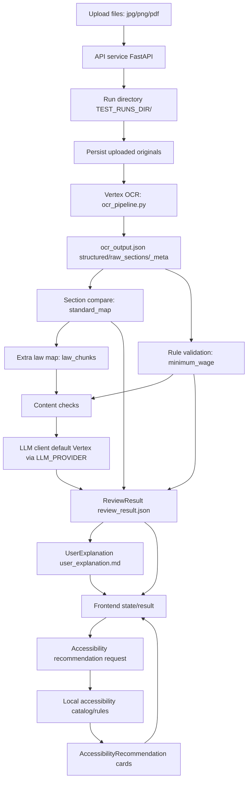

# Before/Begin Data Model

상태: current code-based draft  
기준: `z_before_begin/web` 현재 코드  
범위: 이 문서는 main After/RAG의 `law_chunks` DB/runtime payload data model과 다른 Before/Begin 계약서 분석 앱의 artifact/data model이다.

이 문서는 Before/Begin의 RDB ERD를 만드는 작업이 아니라, 계약서 업로드 파일과 OCR/review 산출물, in-memory job state, local artifacts, Vertex OCR/LLM 경계를 data-flow/artifact model로 정리한다. main `backend/` + `frontend/` After/RAG data model과 섞어서 해석하지 않는다.

## 1. Scope

대상 앱은 `z_before_begin/web` 아래의 Before/Begin 계약서 분석 웹앱이다. 사용자는 계약서 이미지/PDF를 업로드하고, API service는 OCR, 표준항목 비교, 수치 규칙 검증, LLM content review, 사용자 설명 markdown 생성을 수행한다.

이 문서의 대상 데이터:

| Data / Artifact | 포함 범위 |
|---|---|
| Upload files | 사용자가 업로드한 `jpg`, `png`, `pdf` 계약서 원본 |
| Run directory | `z_before_begin/web/test/runs/<timestamp>/` 실행 산출물 디렉터리 |
| OCR output | `ocr_output.json`의 `structured`, `raw_sections`, `_meta` |
| Review result | `review_result.json` / frontend `ReviewResult` 소비 shape |
| User explanation markdown | `user_explanation.md`와 `user_explanation.markdown` |
| Review job state | `app.state.review_jobs` in-memory async job state |
| Asset data | `standard_map.json`, `minimum_wage.yaml`, `law_chunks/all_chunks.json` |
| Accessibility data | 장애 유형 catalog/rules 기반 `AccessibilityRecommendation` |
| Frontend state | `selectedFiles`, `reviewJob`, `review`, `selectedDisability`, `accessibilityData` 등 React local state |

비대상:

| 제외 항목 | 이유 |
|---|---|
| RDB ERD | 현재 Before/Begin 앱은 RDB table 중심이 아니라 local artifact와 process memory 중심이다. |
| main After/RAG DB/runtime model | After의 retrieval/answer/document draft model과 별도다. |
| API contract 변경 | 이 문서는 현재 코드 관찰 결과를 기록한다. endpoint request/response를 새로 정의하지 않는다. |

## 2. Data Boundary Summary

| Boundary | Data | Current code basis | Notes |
|---|---|---|---|
| Input data | uploaded `jpg`/`png`/`pdf` contract files | `app.py` upload endpoints | 계약서 원본에는 개인정보/사업장/임금/비자 신호가 포함될 수 있다. |
| Runtime process memory | `app.state.review_jobs` | `lifespan()`, `_create_review_job()` | async job 상태. 서버 재시작 시 사라진다. |
| Runtime process memory | `app.state.standard_map` | `STANDARD_MAP_PATH` load | 표준 계약서 항목/법령 매핑 asset을 startup에 로드한다. |
| Runtime process memory | `app.state.min_wage` | `MIN_WAGE_YAML_PATH` load | `minimum_wage.yaml`의 `minimum_wage` node를 로드한다. |
| Runtime process memory | `app.state.all_chunks` | `LAW_CHUNKS_PATH` load | Before/Begin local `law_chunks/all_chunks.json` bundle. |
| Runtime process memory | `app.state.llm_client` | `get_llm_client()` | 기본 `LLM_PROVIDER=vertex`; `OllamaClient` 전환 구조는 있음. |
| Local artifact data | `z_before_begin/web/test/runs/<timestamp>/*` | `_create_run_dir()`, `_save_run_artifacts()` | 업로드 원본, OCR/review/markdown/error 파일 저장. |
| Static serving | `/artifacts` mount | `StaticFiles(directory=str(TEST_RUNS_DIR.parent))` | mount scope는 `z_before_begin/web/test` 전체이며 `test/runs`만이 아니다. |
| Asset data | `standard_map.json` | `assets/data/standard_map.json` | 계약서 유형별 sections, required, pattern, related_articles. |
| Asset data | `minimum_wage.yaml` | `assets/config/minimum_wage.yaml` | rule validation의 최저임금 config. |
| Asset data | `law_chunks/all_chunks.json` | `assets/law_chunks/all_chunks.json` | Before/Begin extra law map 조회용 local 법령 chunk bundle. |
| Asset data | accessibility catalog/rules | `assets/data/accessibility/*.yaml` | 장애 특화 추천 카드와 rule. |
| Frontend memory | `selectedFiles`, `reviewJob`, `review`, `selectedDisability`, `accessibilityData` | `front/src/App.tsx` | React local state. durable frontend persistence는 확인되지 않는다. |
| Vertex/privacy boundary | OCR + LLM content review | `ocr_pipeline.py`, `llm_client.py` | Before/Begin contract upload path currently uses Vertex AI for OCR and LLM-based content review by default. |

## 3. Directory / Storage Layout

Source code: `z_before_begin/web/domain/domain/core/settings.py`, `z_before_begin/web/api-service/app/api/app.py`.

| Name | Current value / derivation |
|---|---|
| `WEB_ROOT` | `Path(__file__).resolve().parents[3]` = `z_before_begin/web` |
| `ASSETS_DIR` | `WEB_ROOT / "assets"` |
| `TEST_DIR` | `WEB_ROOT / "test"` |
| `TEST_RUNS_DIR` | `TEST_DIR / "runs"` = `z_before_begin/web/test/runs` |
| `SECRETS_DIR` | `WEB_ROOT / ".secrets"` |
| `LAW_CHUNKS_PATH` | `ASSETS_DIR / "law_chunks" / "all_chunks.json"` |
| `STANDARD_MAP_PATH` | `ASSETS_DIR / "data" / "standard_map.json"` |
| `MIN_WAGE_YAML_PATH` | `ASSETS_DIR / "config" / "minimum_wage.yaml"` |
| `/artifacts` mount | `TEST_RUNS_DIR.parent` = `z_before_begin/web/test` |

Run directory:

| Function | Behavior |
|---|---|
| `_create_run_dir()` | `TEST_RUNS_DIR`를 만들고 local timezone 기준 `"%Y%m%d_%H%M%S_%f"` timestamp 디렉터리를 생성한다. |
| `_safe_upload_filename(index, filename, suffix)` | `01_`, `02_` 같은 index prefix를 붙이고, stem에서 `0-9A-Za-z가-힣_-` 외 문자를 `_`로 정규화한 뒤 suffix를 붙인다. |
| `_build_artifact_url(path)` | `path.relative_to(TEST_RUNS_DIR.parent)` 기준 `/artifacts/...` URL을 반환한다. |
| `_build_run_directory_value(run_dir)` | `run_dir.relative_to(WEB_ROOT)` 기준 `test/runs/<timestamp>` 값을 반환한다. |

중요한 storage note:

- `/artifacts` mount scope는 `TEST_RUNS_DIR.parent`라서 `z_before_begin/web/test` 전체다.
- 일반 실행 산출물은 `z_before_begin/web/test/runs/<timestamp>/`에 저장되지만, static serving boundary는 `test/runs`보다 넓다.
- `Zone.Identifier`, `node_modules`, `front/dist`, `test/runs`, `assets`는 이 문서 작업에서 수정 대상이 아니다.

## 4. Upload File Data

Source code: `app.py`, `front/src/lib/api-client.ts`, `front/src/components/upload/UploadPanel.tsx`.

### Multipart fields

| Field | Type | Caller behavior |
|---|---|---|
| `image` | single `UploadFile` | frontend `files.length === 1`일 때 사용 |
| `images` | list of `UploadFile` | frontend `files.length > 1`일 때 각 파일을 append |

### Accepted content types

| `content_type` | Persisted suffix |
|---|---|
| `image/jpeg` | `.jpg` |
| `image/png` | `.png` |
| `application/pdf` | `.pdf` |

Frontend file input은 `accept=".jpg,.jpeg,.png,.pdf"`로 표시하지만, backend validation은 request `content_type` 기준으로 위 3개만 suffix를 부여한다.

### Validation outcomes

| Condition | Current outcome |
|---|---|
| no files | `422`, `업로드된 파일이 없습니다.` |
| empty file bytes | `422`, `빈 파일입니다: <filename>` |
| unsupported content type | `422`, `지원하지 않는 파일 형식: ... jpg/png/pdf 만 허용.` |
| PDF multiple upload | `422`, PDF는 단일 파일만 허용 |
| PDF + image mixed upload | `422`, 혼합 업로드 불가. 현재 코드상 `has_pdf and len(normalized) > 1` 검사가 먼저라 "PDF는 단일 파일" message가 먼저 나올 수 있다. |

### Persisted uploaded file object

`_persist_uploaded_files()`는 run directory 안에 원본 bytes를 저장하고 다음 object를 만든다.

| Field | Type | Semantics |
|---|---|---|
| `name` | string | `_safe_upload_filename()`이 만든 저장 파일명 |
| `path` | string | local filesystem absolute-ish path string |
| `url` | string | `/artifacts/runs/<timestamp>/<filename>` 형태 |

Privacy note:

- uploaded contract file can include name, address, phone, wage, workplace, visa/nationality/passport/alien registration signals.
- 이 원본은 OCR 입력으로 Vertex AI에 전달될 수 있고, local artifact로도 저장된다.

## 5. ReviewJob / Progress State

Source code: `app.py`, `front/src/types/review.ts`, `front/src/App.tsx`.

`app.state.review_jobs`는 in-memory dict이다. `POST /api/v1/contract/review/jobs`가 `_create_review_job()` 결과를 저장하고, background task인 `_run_review_job()`가 같은 dict를 갱신한다.

### ReviewJob fields

| Field | Type | Source |
|---|---|---|
| `job_id` | string UUID | `_create_review_job()` |
| `status` | `queued` \| `running` \| `completed` \| `failed` | backend + TS type |
| `created_at` | UTC ISO string | `_now_iso()` |
| `updated_at` | UTC ISO string | `_now_iso()` / step update |
| `run_directory` | string \| null | run dir 생성 후 `test/runs/<timestamp>` |
| `error` | string \| null | failure message |
| `steps` | `ReviewJobStep[]` | `_build_progress_steps()` |
| `result` | `ReviewResult` \| null | completed job result |

### ReviewJobStep fields

| Field | Type |
|---|---|
| `key` | string |
| `label` | string |
| `order` | number |
| `status` | `pending` \| `running` \| `completed` \| `failed` |
| `message` | string \| null |

### Progress steps

| key | label | order |
|---|---|---:|
| `file_validation` | `파일 확인` | 1 |
| `ocr` | `OCR 추출` | 2 |
| `section_compare` | `계약 항목 비교` | 3 |
| `rule_validation` | `수치 검증` | 4 |
| `explanation` | `설명 생성` | 5 |

Limitations:

- job state is process memory only. 서버 재시작 시 `app.state.review_jobs`는 사라진다.
- frontend는 `reviewJob.status`가 `queued` 또는 `running`인 동안 `getReviewJob()`을 1000ms 간격으로 polling한다.
- `_run_review_job()`에서 `_create_run_dir()`와 `job["run_directory"]` 설정이 try 블록 밖이라 early setup failure가 polling response의 `failed` 상태로 항상 반영된다고 보장하기 어렵다. 이 limitation은 `api_spec.md`와 동일하다.

## 6. OCR Output Model

Source code: `ocr_pipeline.py`, `schemas/contract.py`; example snapshots under `z_before_begin/web/test/test_sen*`.

`ocr_output.json` top-level shape:

| Field | Type | Source |
|---|---|---|
| `structured` | object | Vertex Layer 1 structured extraction |
| `raw_sections` | object | Vertex Layer 2 section text extraction, normalized |
| `_meta` | object | pipeline metadata and validation |

### `structured`

`structured`는 `SCHEMA_BY_CONTRACT_TYPE`에 따른 계약 유형별 Pydantic schema를 기준으로 validation된다. 실제 LLM output은 prompt상 외국인 신호 필드도 포함할 수 있고, Pydantic schema가 모르는 extra field는 runtime dict에 남을 수 있다.

공통 주요 field:

| Field | Notes |
|---|---|
| `employer_party_name` | 전문의 사업주명 |
| `employee_party_name` | 전문의 근로자명 |
| `start_date` | 근로개시일. fixed-term/foreign schema는 `contract_start_date`, `contract_end_date`도 사용 |
| `workplace` | 근무장소 / 근로장소 |
| `job_description` | 업무내용 |
| `working_hours` | `start`, `end`, `break_start`, `break_end`, `daily_hours`, `weekly_hours` |
| `work_days` | `days_per_week`, `work_days_detail`, `weekly_holiday_day` |
| `wage` | `wage_type`, `wage_amount`, `bonus_*`, `allowance_*`, `payment_cycle`, `payment_day`, payment methods |
| `social_insurance` | `exception_note` |
| `signed_date` | 계약서 작성일 |
| `employer` | `company_name`, `phone`, `address`, `representative` |
| `employee` | `name`, `address`, `contact` |
| `contract_form_type` | prompt/output/meta에서 사용: `standard_foreign_worker`, `standard_general`, `custom_form`, `unknown` |
| `foreign_worker_signals` | `visa_type`, `nationality`, `passport_mentioned`, `alien_registration_mentioned` |
| `dormitory_info` | `provided`, `location`, `facility_type`, `area`, `deduction_amount`, `written_disclosed`; meta enrichment에는 `disclosed_fields_count`, `deferred_notice`도 있음 |
| `high_risk_clauses` | `passport_custody`, `mobility_restriction`, `liquidated_damages`, `blanket_company_rules` |

계약 유형 enum / schema:

| ContractType value | Schema class |
|---|---|
| `기간의_정함이_없는_경우` | `NoFixedTermContractData` |
| `기간의_정함이_있는_경우` | `FixedTermContractData` |
| `연소근로자` | `MinorContractData` |
| `건설일용근로자` | `ConstructionContractData` |
| `단시간근로자` | `PartTimeContractData` |
| `외국인근로자` | `ForeignWorkerContractData` |
| `알수없음` | `NoFixedTermContractData` fallback |

Note:

- `schemas/contract.py`의 class들은 core contract fields를 정의한다.
- `ocr_pipeline.py`의 prompt는 `contract_form_type`, `foreign_worker_signals`, `dormitory_info`, `high_risk_clauses`를 structured output에 요구한다.
- 실제 `_meta`에도 worker/context enrichment가 별도로 저장된다.

### `raw_sections`

| Field | Type | Semantics |
|---|---|---|
| `contract_title` | string | 계약서 제목 |
| `preamble` | string | 전문 원문 |
| `sections` | object[] | `number`, `title`, `full_text` |
| `signature_block` | string | 날짜/서명 블록 원문 |

`_normalize_raw_sections()`는 section number를 string으로 정규화하고, 번호 중복 시 `"<number>_<index>"` 형태로 조정한다. 제목이 비어 있으면 `"<index>항"` fallback을 둔다.

### `_meta`

현재 코드에서 확인되는 `_meta` fields:

| Field | Type | Notes |
|---|---|---|
| `source_file` | string | 첫 파일명 |
| `source_files` | string[] | 페이지 파일명 목록 |
| `page_count` | number | OCR input page count |
| `contract_type` | ContractType value | OCR title/preamble/worker context 기반 추론 |
| `worker_group` | `general` \| `foreign_worker` | score 기반 |
| `worker_group_confidence` | `general` \| `suspected` \| `confirmed` | score 기반 confidence |
| `worker_group_score` | number | foreign worker signal score |
| `worker_group_reasons` | string[] | scoring reason list |
| `contract_form_type` | string | `standard_foreign_worker`, `standard_general`, `custom_form`, `unknown` |
| `foreign_worker_signals` | object | visa/nationality/passport/alien registration signals |
| `dormitory_info` | object | dormitory/sukso written disclosure signals |
| `high_risk_clauses` | object | passport custody, mobility restriction, liquidated damages, company rules |
| `schema_class` | string | selected Pydantic schema class name |
| `validation` | object | `passed`, `missing_fields`, `schema_errors` |

OCR / LLM parsing notes:

- OCR uses Vertex AI generative model through `vertexai.generative_models.GenerativeModel`.
- uploaded image/pdf bytes are converted to Vertex AI `Part`.
- Layer 1 and Layer 2 both request `response_mime_type="application/json"` and `temperature=0.0`.
- `_parse_json_response()` accepts plain JSON or fenced JSON code block. It extracts the first JSON object if possible.
- 수치 검증은 `structured`가 아니라 `raw_sections`를 다시 파싱한다.

TODO:

- `_meta.validation.schema_errors`는 Pydantic error string을 list item에 담는다. 배포 contract에서는 structured error schema를 별도로 정리할 필요가 있다.

## 7. Contract Review Result Model

Source code: `app.py` `aggregate_results()`, `front/src/types/review.ts`.

`review_result.json` / `ReviewResult` fields:

| Field | Type | Source / notes |
|---|---|---|
| `review_id` | string UUID | `aggregate_results()` |
| `reviewed_at` | UTC ISO string | `aggregate_results()` |
| `run_directory` | string | pipeline response enrichment; older fixed snapshots may omit |
| `uploaded_files` | `UploadedFile[]` | pipeline response enrichment; older fixed snapshots may omit |
| `contract_info` | object | `type`, `employer`, `employee`, `start_date` |
| `scenario_tags` | string[] | runtime response includes it; current TS `ReviewResult` does not explicitly include it |
| `ocr_snapshot` | object | review-used critical OCR fields |
| `ocr_conflicts` | object[] | structured vs raw parsed/resolved conflict list |
| `ocr_warnings` | object[] | runtime warning items; TS type assumes `corrected` exists |
| `overall_result` | `PASS` \| `WARNING` \| `VIOLATION` | worst of section/rule/content |
| `overall_severity` | `NONE` \| `LOW` \| `MEDIUM` \| `HIGH` \| `CRITICAL` | worst severity |
| `section_check` | object | `missing`, `extra`, `mismatches`; response excludes `role_mapping` |
| `rule_check` | `Record<string, object>` | `minimum_wage`, `working_hours`, `break_time`, `payment_day` |
| `content_check` | `Record<section_no, object>` | LLM content check result map |
| `risk_summary` | object/map | runtime response includes buckets; current TS type does not explicitly include it |
| `summary` | string | compact sentence |
| `user_explanation` | `UserExplanation` | deterministic user-facing object |

### `contract_info`

| Field | Type | Notes |
|---|---|---|
| `type` | string | `_meta.contract_type` |
| `employer` | string | preamble regex fallback to `structured.employer_party_name` |
| `employee` | string | preamble regex fallback to `structured.employee_party_name` |
| `start_date` | string | `structured.start_date`; TODO: fixed-term/foreign `contract_start_date` fallback 검토 필요 |

### Status / severity enums

| Enum | Values |
|---|---|
| Review status | `PASS`, `WARNING`, `VIOLATION` |
| Severity | `NONE`, `LOW`, `MEDIUM`, `HIGH`, `CRITICAL` |

### `ocr_warnings` mismatch note

Runtime `build_ocr_warnings()` can emit:

| Field | Runtime behavior |
|---|---|
| `field` | warning target field |
| `structured` | structured extraction value |
| `corrected` | working-hours recalculation warning can include it |
| `raw` | employee name mismatch warning can include it instead of `corrected` |
| `note` | warning description |

Frontend `ReviewResult.ocr_warnings` currently types `corrected` as required. 실제 runtime warning item에서 `corrected`가 항상 존재한다고 확정할 수 없다.

TODO: backend warning shape normalization or frontend type optional handling.

### TS type vs runtime response

| Area | Runtime | TS type |
|---|---|---|
| `scenario_tags` | present in current aggregate response | not explicit in `ReviewResult` |
| `ocr_snapshot` | present | not explicit in `ReviewResult` |
| `ocr_conflicts` | present | not explicit in `ReviewResult` |
| `content_check` | present | not explicit in `ReviewResult` |
| `risk_summary` | present | not explicit in `ReviewResult` |
| `section_check.extra[].full_text` | runtime extra includes `full_text` | TS only has `number`, `title` |
| `ocr_warnings[].corrected` | optional by runtime path | required in TS |
| `UserExplanation.important_points[].law_ref` | builder may emit nullable/optional for content points | TS requires `string` |

Content/rule check nested structures are runtime dicts in places. 이 문서에서는 exact nested schema를 확정하지 않고 object/map으로 둔다.

## 8. Section / Rule / Content Check Data

### Section result

Source code: `section_comparator.py`.

`compare_sections()` internal result:

| Field | Type | Notes |
|---|---|---|
| `role_mapping` | `Record<standard_title, ocr_section_number>` | standard section title to OCR section number |
| `missing` | object[] | `{ number, title, required }` |
| `extra` | object[] | `{ number, title, full_text }` |
| `mismatches` | object[] | `{ number, standard_title, actual_title, similarity }` |
| `has_issues` | boolean | `missing` or `extra` or `mismatches` exists |

`aggregate_results()` response의 `section_check`에는 `missing`, `extra`, `mismatches`만 포함되고 `role_mapping`은 직접 노출하지 않는다.

### Rule result

Source code: `rule_validator.py`.

| Function | Output role |
|---|---|
| `parse_working_hours(full_text)` | raw section text에서 `start_h`, `end_h`, `break_minutes`, `net_minutes`, `daily_hours_float` 등 파싱 |
| `parse_wage_info(full_text)` | `wage_type`, `amount` 파싱 |
| `parse_days_per_week(full_text)` | 주 근무일수 파싱 |
| `validate_all(output, role_mapping, min_wage_config)` | rule result map 생성 |

`validate_all()` output map:

| Key | Common fields | Additional fields |
|---|---|---|
| `minimum_wage` | `status`, `severity`, `message` | `wage_type`, `stated_amount`, `calc_daily_hours`, `days_per_week`, `weekly_hours`, `juyu_hours`, `juyu_applied`, `total_weekly_hours`, `monthly_hours`, `calc_hourly`, `minimum_wage_year`, `min_hourly`, `min_monthly_209h`, `shortfall` |
| `working_hours` | `status`, `severity`, `message`, `law_ref` | `stated_daily`, `actual_daily`, `break_hours`, `legal_max_daily` |
| `break_time` | `status`, `severity`, `message`, `law_ref` | `gross_work_hours`, `break_minutes`, `required_break_min` |
| `payment_day` | `status`, `severity`, `message`, `law_ref` | `payment_day` if parsed |

Rule status/severity use the same `PASS` / `WARNING` / `VIOLATION` and `NONE` / `LOW` / `MEDIUM` / `HIGH` / `CRITICAL` value space. Rule validation is local Python logic; numeric calculation is not delegated to LLM.

### Content result

Source code: `content_checker.py`, `law_retriever.py`, `llm_client.py`.

`check_all_sections()` returns `Record<section_no, result>`.

Common result shape from prompts/enrichment:

| Field | Type / values |
|---|---|
| `status` | `PASS` \| `WARNING` \| `VIOLATION` |
| `severity` | `NONE` \| `LOW` \| `MEDIUM` \| `HIGH` \| `CRITICAL` |
| `is_non_standard` | boolean |
| `worker_group` | `general` \| `foreign_worker` |
| `issue_type` | `standard_form_misuse`, `dormitory_missing_info`, `passport_custody`, `mobility_restriction`, `liquidated_damages`, `blanket_company_rules`, `wage_deduction_risk`, `mandatory_terms_missing`, `other` |
| `risk_bucket` | `immediate_illegal`, `mandatory_missing`, `deduction_risk`, `enforceability_risk`, `other` |
| `issues` | object[] with `description`, `law_ref`, `severity`, `issue_type`, `risk_bucket` |
| `comment` | string, especially extra section path |
| `confidence` | `HIGH` \| `MEDIUM` \| `LOW` |
| `error` | string if LLM client returns warning error response |

`extra_law_map`:

| Input | Output |
|---|---|
| `section_result["extra"]` + `app.state.all_chunks` | `Record<section_no, law_chunk[]>` |

`law_chunk` objects used in content prompts include `chunk_id`, `citation_label`, `content_normalized`, `law_name`, `matched_keyword`. This is a local Before/Begin `law_chunks` asset lookup, not a pgvector/RAG retrieval call.

TODO: Pydantic schema 정리 필요. 특히 `content_check`, `rule_check`, `risk_summary`는 runtime dict 중심이라 frontend/backend alignment가 느슨하다.

## 9. UserExplanation Model

Source code: `explanation_builder.py`, `front/src/types/review.ts`.

`build_user_explanation()` output:

| Field | Type | Notes |
|---|---|---|
| `headline` | string | overall result/severity 기반 |
| `plain_language_summary` | string | 사용자용 쉬운 요약 |
| `overall_assessment` | string[] | 전체 평가 bullet |
| `important_points` | object[] | rule/content point 합산 후 severity/risk 기준 정렬 |
| `recommended_actions` | string[] | 권장 조치 |
| `evidence` | object[] | OCR snapshot/section result 기반 근거 발췌 |
| `markdown` | string | `user_explanation.md`로 저장 가능 |

### `important_points[]`

| Field | Runtime notes |
|---|---|
| `title` | string |
| `status` | `PASS` \| `WARNING` \| `VIOLATION`; PASS point는 보통 제외 |
| `severity` | severity enum |
| `law_ref` | rule point는 string, content point는 nullable/optional 가능 |
| `description` | string |
| `issue_type` | builder output can include it |
| `risk_bucket` | builder output can include it |

Frontend `ExplanationPoint` currently requires `law_ref: string` and does not include `issue_type` / `risk_bucket`. `ResultPanel` fallback path coerces rule `law_ref ?? ""`, but `user_explanation.important_points`는 그대로 사용한다.

TODO: frontend UserExplanation type and builder output alignment. 특히 `law_ref` nullable/optional 여부와 `issue_type` / `risk_bucket` extra fields를 맞춰야 한다.

### `evidence[]`

| Field | Type |
|---|---|
| `title` | string |
| `excerpt` | string |

### Markdown artifact

`_build_markdown()` includes UI guide comments and sections:

- `HEADLINE`
- `OVERVIEW`
- `ISSUE_CARDS`
- `ACTIONS`
- `EVIDENCE_TOGGLE`

`_save_run_artifacts()` saves `user_explanation.md` only when `response.user_explanation.markdown` exists and is non-empty.

## 10. Artifact Files

Source code: `app.py` `_save_run_artifacts()`, `run_contract_review_pipeline()`, `_run_review_job()`.

### Successful run

| File / object | Created by |
|---|---|
| uploaded original files | `_persist_uploaded_files()` |
| `ocr_output.json` | `_save_run_artifacts()` in sync path; directly saved after OCR in async path |
| `review_result.json` | `_save_run_artifacts()` |
| `user_explanation.md` | `_save_run_artifacts()` if markdown exists |

### Failure artifacts

| Failure point | Artifacts |
|---|---|
| OCR failure in sync path | uploaded originals + `error.txt` |
| review generation failure in sync path | uploaded originals + `ocr_output.json` + `error.txt` |
| async job failure | uploaded originals if persisted; `ocr_output.json` if OCR output exists and failure is after OCR; `error.txt` for normal pipeline failures. For early setup failures before run directory creation, such as `_create_run_dir()` failure, run directory and `error.txt` may not exist and polling `failed` is not strongly guaranteed. |

Async and sync paths both persist artifacts under `TEST_RUNS_DIR`.

Artifact URL:

| Function | URL shape |
|---|---|
| `_build_artifact_url(path)` | `/artifacts/<path relative to z_before_begin/web/test>` |
| usual run file | `/artifacts/runs/<timestamp>/<filename>` |

Privacy:

- artifact files may contain personal/workplace information.
- `ocr_output.json` and `review_result.json` can contain extracted names, addresses, phone/contact, wages, workplace, nationality/visa/passport signals, dormitory details, and legal risk descriptions.
- `/artifacts` currently serves `TEST_RUNS_DIR.parent`, so production access control and retention policy are required before deployment.

## 11. Asset Data Model

Source code: `settings.py`, `section_comparator.py`, `rule_validator.py`, `law_retriever.py`, `accessibility/catalog.py`.

| Asset | Path | Current use |
|---|---|---|
| `standard_map.json` | `z_before_begin/web/assets/data/standard_map.json` | 표준 계약서 sections, required 여부, standard content pattern, related law articles |
| `minimum_wage.yaml` | `z_before_begin/web/assets/config/minimum_wage.yaml` | 최저임금 수치 검증 config |
| `law_chunks/all_chunks.json` | `z_before_begin/web/assets/law_chunks/all_chunks.json` | extra section law lookup and content prompt context |
| `disability_profiles.yaml` | `z_before_begin/web/assets/data/accessibility/disability_profiles.yaml` | disability type labels, aliases, summaries |
| `job_traits.yaml` | `z_before_begin/web/assets/data/accessibility/job_traits.yaml` | optional job trait catalog |
| `accommodation_catalog.yaml` | `z_before_begin/web/assets/data/accessibility/accommodation_catalog.yaml` | accommodation/right cards |
| `support_program_catalog.yaml` | `z_before_begin/web/assets/data/accessibility/support_program_catalog.yaml` | support program cards |
| `recommendation_rules.yaml` | `z_before_begin/web/assets/data/accessibility/recommendation_rules.yaml` | disability type to card/rule mapping |

### `standard_map.json`

Observed model:

| Level | Fields |
|---|---|
| root | contract type keys such as `기간의_정함이_없는_경우`, `기간의_정함이_있는_경우`, `연소근로자`, `건설일용근로자`, `단시간근로자`, `외국인근로자` |
| contract type | `sections` |
| section | `title`, `required`, `standard_content_pattern`, `related_articles` |
| `related_articles[]` | `chunk_id`, `citation_label`, `content_normalized`, `relevance` |

### `minimum_wage.yaml`

Current loaded node is `minimum_wage`. Confirmed fields include:

| Field | Meaning |
|---|---|
| `year` | 적용 연도 |
| `hourly` | 시간급 최저임금 |
| `monthly_209h` | 월 209시간 기준 환산액 |
| `daily_8h` | 8시간 기준 일급 |

### `law_chunks/all_chunks.json`

Current local Before/Begin bundle has `law_chunks` style objects with fields such as `chunk_id`, `citation_label`, `law_name`, `doc_type`, `tier`, `content_normalized`, `selected_as_of`, `selected_commit`.

Note:

- `z_before_begin/web/assets/law_chunks/all_chunks.json` is a local Before/Begin asset.
- It may currently mirror the main corpus shape and observed count, but it is a separate bundle from main backend `backend/data/law_chunks/all_chunks.json`.
- TODO: law_chunks asset/corpus sync with main backend needs integrated review after team merge.

Do not modify assets directly in this task.

## 12. Accessibility Recommendation Model

Source code: `recommendation_engine.py`, `catalog.py`, `front/src/types/review.ts`, `front/src/App.tsx`.

This path is separate from OCR/LLM contract review pipeline. It uses local YAML catalog/rules and does not call Vertex.

### Request

| Field | Type | Notes |
|---|---|---|
| `disability_type` | string | key or alias. Normalized by `_normalize_disability_type()` |
| `job_traits` | string[] | optional/default `[]`; current frontend calls with `[]` |

Accepted normalized disability types from catalog/frontend:

| Key | Label / aliases |
|---|---|
| `visual` | `시각`, `visual` |
| `hearing` | `청각`, `hearing` |
| `mobility` | `지체`, `뇌병변`, `mobility` |
| `cognitive` | `발달`, `인지`, `cognitive` |
| `mental` | `정신`, `mental` |
| `complex` | `복합`, `기타`, `complex` |

### Response: `AccessibilityRecommendation`

| Field | Type |
|---|---|
| `disability_type` | normalized disability key |
| `disability_label` | label from profile |
| `overview` | summary string |
| `cards` | `AccessibilityCard[]` |
| `legal_basis` | deduped law refs from cards |

### Card

| Field | Type | Notes |
|---|---|---|
| `id` | string | card id or generated question id |
| `kind` | `right` \| `support` \| `question` \| `law` | TS type supports all four |
| `title` | string | card title |
| `description` | string | card description |
| `law_refs` | string[] | 법령 근거 label list |
| `action_hint` | string \| null \| undefined | YAML source may omit it; engine uses `source.get("action_hint")`; TS marks optional `string` |

Notes:

- `_build_question_card()` question cards currently omit `action_hint`.
- frontend `AccessibilityPanel` renders `card.action_hint` only if truthy.
- frontend fallback mock exists: if API call fails, `fallbackAccessibilityRecommendation(disabilityType)` is used and `accessibilityError` is shown.
- TODO: accessibility action_hint nullable/optional handling should be aligned between backend response and TS type.

## 13. Frontend Runtime State

Source code: `front/src/App.tsx`, `front/src/types/review.ts`, `front/src/lib/api-client.ts`.

| State | Type | Meaning |
|---|---|---|
| `screenState` | `home` \| `loading` \| `result` | current screen state |
| `selectedFiles` | `File[]` | browser-selected upload files |
| `review` | `ReviewResult | null` | completed review result |
| `reviewJob` | `ReviewJob | null` | async job progress and final result |
| `requestError` | `string | null` | upload/review error message |
| `isSubmitting` | boolean | submit button/loading flag |
| `selectedDisability` | `DisabilityType | null` | selected accessibility option |
| `accessibilityData` | `AccessibilityRecommendation | null` | recommendation response or fallback |
| `accessibilityError` | `string | null` | accessibility API fallback/error message |
| `isAccessibilityLoading` | boolean | accessibility loading flag |

Frontend behavior:

- State is React local state only. No `localStorage`, `sessionStorage`, IndexedDB, or cookie persistence was observed in the inspected frontend code.
- `startReviewJob(selectedFiles)` creates async job; frontend polls `getReviewJob(job_id)` every 1000ms while status is not `completed` / `failed`.
- On `completed` with `result`, frontend stores result in `review` and moves to `result`.
- On `failed` or polling error, frontend shows request error and returns to `home`.
- `loadMockReview("sen0" | "sen1" | "sen2")` fetches `/mock/review_result_<scenario>.json`; this is frontend mock loading, not API contract.
- `resolveArtifactUrl(file.url)` prepends API artifact base when needed and is used for uploaded file previews.

## 14. Privacy / Security Boundary

Before/Begin contract upload path currently uses Vertex AI for OCR and LLM-based content review.

Privacy facts:

| Area | Boundary |
|---|---|
| Uploaded file | uploaded contract can include personal/workplace/sensitive labor data |
| Vertex OCR | `ocr_pipeline.py` sends image/pdf bytes to Vertex AI generative model via `Part` |
| Vertex LLM content review | default `LLM_PROVIDER=vertex` creates `VertexAIClient`, which sends prompts containing contract section text and law context |
| Local artifacts | saved under `z_before_begin/web/test/runs/<timestamp>/` |
| Static serving | `/artifacts` serves `TEST_RUNS_DIR.parent = z_before_begin/web/test` |
| Secrets | `GOOGLE_APPLICATION_CREDENTIALS`, `GCP_PROJECT_ID`, `GCP_LOCATION`, `VERTEX_MODEL`; local `.secrets/vertex-phase-a.env` fallback |
| Alternate provider | `OllamaClient` exists, but default provider is Vertex |

Sensitive examples:

- worker/employer name
- address, phone/contact
- wage amount, payment day, working hours
- workplace and job description
- nationality, visa type, passport mention, alien registration mention
- dormitory/sukso location, facility type, area, deduction amount
- high-risk labor clauses and legal review conclusions

Deployment TODOs:

| Topic | Needed policy |
|---|---|
| storage access control | local `/artifacts` should not be public/unbounded in production |
| retention/TTL | define artifact retention, deletion, and cleanup workflow |
| request/body logging controls | avoid logging multipart body, OCR text, full review JSON, full prompts |
| artifact URL protection | protect `/artifacts` URLs and narrow mount scope |
| secrets management | replace local service account fallback with managed secret/IAM where applicable |
| provider disclosure | disclose Vertex OCR/LLM use for uploaded contracts |
| PII masking/redaction strategy | filenames, OCR text, review JSON, prompts, logs |

Do not write "프로젝트 전체에서 개인정보가 Vertex로 가지 않는다." Before/Begin upload/review path can send contract content to Vertex by default.

## 15. Data Flow / Diagram

이 문서는 RDB ERD가 아니라 artifact/data-flow model이다. 아래 Mermaid diagram은 runtime artifact 흐름을 축약한 것이다.

## 16. Current Limitations / TODO

- job state is in-memory only: `app.state.review_jobs`는 process memory에만 있고 서버 재시작 시 사라진다.
- local test/runs artifact storage: uploads and outputs are saved under `z_before_begin/web/test/runs`.
- `/artifacts` mount scope too broad for production without access control: current mount is `TEST_RUNS_DIR.parent`, 즉 `z_before_begin/web/test`.
- response schemas are runtime dicts in places, need Pydantic/TS alignment.
- `ocr_warnings` `corrected` mismatch: runtime item may have `raw` without `corrected`; TS currently requires `corrected`.
- `UserExplanation.important_points` builder/frontend type mismatch: builder can include `issue_type`, `risk_bucket`, and nullable/optional `law_ref`; TS requires `law_ref: string`.
- early setup failure handling limitation: `_run_review_job()` run directory creation occurs before try block.
- accessibility `action_hint` nullable/optional handling should be aligned.
- `law_chunks` asset/corpus sync with main backend needs integrated review.
- integrated data model after team merge: Before/Begin and After/RAG should be reconciled only after actual integration.
- Ollama provider exists but default provider is vertex through `LLM_PROVIDER=vertex`.
- `contract_info.start_date` currently reads `structured.start_date`; TODO: fixed-term/foreign `contract_start_date` fallback policy 확인.
- File size limit, artifact TTL, concurrency limit, and cloud storage migration are not fixed in current code.
